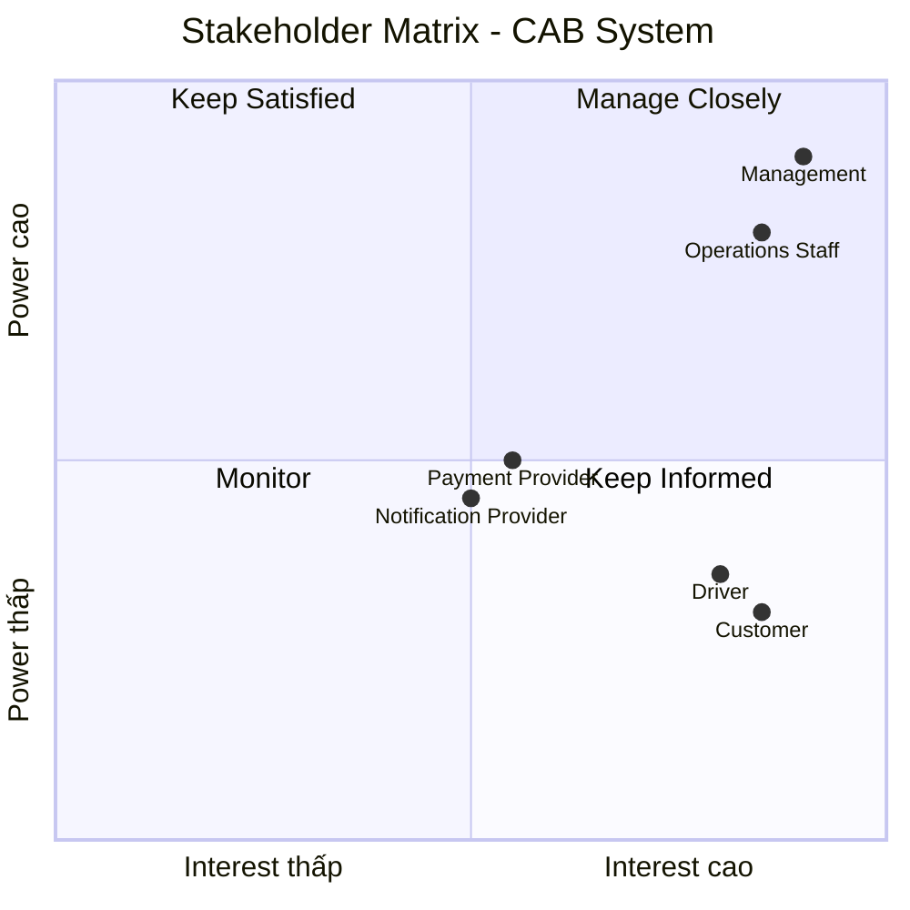
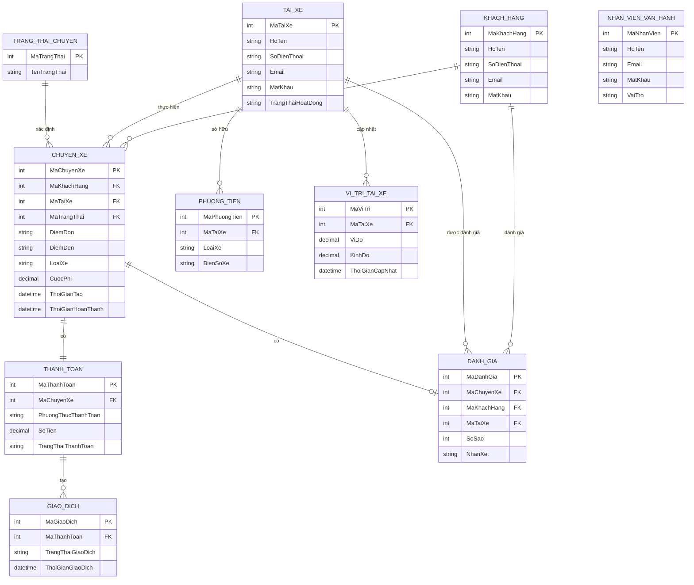
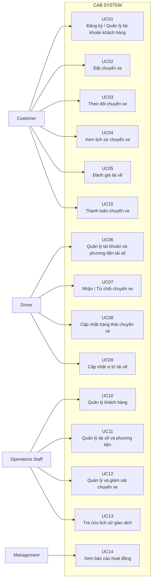

File mrd viết bằng markdown

Phân tích thiết kế hệ thống mvb, demo tối thiểu khách hàng

Bước 1: đọc và phân tích sơ khởi của khách hàng(Bussiness Contact) ngữ cảnh cửa nghiệp vụ

...

Bước 2:Phải xác định stakeholder trong bài. làm 1 bảng gồm 2 cột. Cột 1 là tên stake cột 2 là vai trò(ví dụ: stake:customer vai trò: đặt xe). Vẽ ma trận stakeholder matrix cho biết tầm ảnh hưởng quan trọng của stake trong hệ thống(vẽ bằng công cụ Mermaid dùng vẽ lượt đồ trong markdown).

2.1. Bảng Stakeholder

| Stakeholder               | Vai trò                                                                                            |
| ------------------------- | -------------------------------------------------------------------------------------------------- |
| **Customer**              | Đăng ký/đăng nhập, đặt xe, theo dõi chuyến đi, xem lịch sử, thanh toán và đánh giá tài xế          |
| **Driver**                | Quản lý hồ sơ/phương tiện, nhận hoặc từ chối chuyến, cập nhật trạng thái và vị trí chuyến xe       |
| **Operations Staff**      | Quản lý khách hàng, tài xế, phương tiện, chuyến đi; giám sát và xử lý các trường hợp chuyến bị lỗi |
| **Management**            | Theo dõi báo cáo về số lượng chuyến, doanh thu, tỷ lệ hoàn thành, tỷ lệ hủy và hiệu quả tài xế     |
| **Payment Provider**      | Cung cấp dịch vụ thanh toán điện tử cho hệ thống CAB                                               |
| **Notification Provider** | Cung cấp các kênh gửi thông báo cho khách hàng và tài xế                                           |

2.2. Stakeholder Matrix

Ma trận Stakeholder được xây dựng dựa trên hai tiêu chí: Power (Tầm ảnh hưởng) và Interest (Mức độ quan tâm).

Management: Power cao – Interest cao → Manage Closely.

Operations Staff: Power cao – Interest cao → Manage Closely.

Customer: Power thấp – Interest cao → Keep Informed.

Driver: Power thấp – Interest cao → Keep Informed.

Payment Provider: Power trung bình – Interest trung bình → Keep Satisfied.

Notification Provider: Power trung bình – Interest trung bình → Keep Satisfied.

2.3. Mermaid – Stakeholder Matrix

Bước 3: Xác đinh bussines goal mà mình thấy (ví dụ: bussiness goal là BG01: Giảm thời gian tìm tài xế) mục đích là hệ thống có chức năng tự động tìm tài xế (ví dụ 2: BG02: Cho phép thanh toán bằng tiền mặt và trực tuyến).
| Mã       | Business Goal                                                       | Mục đích / Hệ thống cần hỗ trợ                                                                                                                                                                    |
| -------- | ------------------------------------------------------------------- | ------------------------------------------------------------------------------------------------------------------------------------------------------------------------------------------------- |
| **BG01** | **Giảm thời gian và công sức tìm kiếm, phân công tài xế**           | Hệ thống có chức năng **tự động tìm và ưu tiên tài xế phù hợp** dựa trên vị trí, trạng thái sẵn sàng và các tiêu chí vận hành.                                                                    |
| **BG02** | **Cải thiện khả năng theo dõi chuyến đi của khách hàng**            | Hệ thống cho phép khách hàng **theo dõi trạng thái chuyến đi**, biết tài xế nào nhận chuyến và thời gian dự kiến tài xế đến.                                                                      |
| **BG03** | **Cho phép khách hàng thanh toán bằng nhiều phương thức**           | Hệ thống hỗ trợ **thanh toán bằng tiền mặt và thanh toán điện tử** thông qua nhà cung cấp thanh toán bên ngoài.                                                                                   |
| **BG04** | **Cung cấp thông tin và thông báo kịp thời cho khách hàng, tài xế** | Hệ thống có chức năng **gửi thông báo** khi đặt xe được tiếp nhận, tài xế nhận chuyến, tài xế đến điểm đón, chuyến hoàn thành và thanh toán có kết quả.                                           |
| **BG05** | **Nâng cao hiệu quả quản lý và vận hành hệ thống**                  | Hệ thống cung cấp **giao diện quản trị** để nhân viên quản lý khách hàng, tài xế, phương tiện, chuyến đi và xử lý các trường hợp chuyến bị lỗi.                                                   |
| **BG06** | **Hỗ trợ theo dõi và đánh giá hiệu quả kinh doanh**                 | Hệ thống cung cấp **báo cáo** về số lượng chuyến, doanh thu, tỷ lệ chuyến hoàn thành, tỷ lệ hủy và hiệu quả hoạt động của tài xế.                                                                 |
| **BG07** | **Đảm bảo hệ thống hoạt động ổn định khi nhu cầu tăng cao**         | Hệ thống có khả năng **mở rộng các thành phần độc lập**, đồng thời lỗi ở thanh toán hoặc thông báo không làm toàn bộ hệ thống đặt xe ngừng hoạt động.                                             |
| **BG08** | **Đảm bảo an toàn và bảo mật thông tin**                            | Hệ thống thực hiện **xác thực, phân quyền, bảo vệ dữ liệu cá nhân, dữ liệu vị trí, dữ liệu giao dịch và lưu vết các thao tác quan trọng**.                                                        |
| **BG09** | **Xây dựng nền tảng CAB có khả năng phát triển lâu dài**            | Hệ thống có kiến trúc linh hoạt để **bổ sung dịch vụ mới, phương thức thanh toán mới, nhà cung cấp thông báo mới hoặc thay đổi thành phần kỹ thuật** mà không phải xây dựng lại toàn bộ hệ thống. |

Bước 4: Xác định phạm vi yêu cầu cần phải làm(Scope). Ví dụ: Quản lý khách hàng, quản lý tài xế. Trong Scope phải liệt kê các yêu cầu cần phải làm cho hệ thống dưới gốc độ là 1 bản hệ thống mvb. Những cái nào tôi không nên làm trong đây 

4.1. Phạm vi hệ thống

Đối với bản MVP/MVB của CAB System, phạm vi nên tập trung vào quy trình đặt và hoàn thành một chuyến xe, bao gồm:
| STT    | Phạm vi                      | Các yêu cầu cần thực hiện trong MVB                                                                                                                          |
| ------ | ---------------------------- | ------------------------------------------------------------------------------------------------------------------------------------------------------------ |
| **1**  | **Quản lý khách hàng**       | Đăng ký tài khoản, đăng nhập, cập nhật thông tin cá nhân.                                                                                                    |
| **2**  | **Đặt xe**                   | Nhập điểm đón, điểm đến, lựa chọn loại xe và gửi yêu cầu đặt xe.                                                                                             |
| **3**  | **Tìm và phân công tài xế**  | Tìm tài xế phù hợp dựa trên trạng thái sẵn sàng; ưu tiên tài xế phù hợp/gần khách hàng; nếu tài xế từ chối hoặc không phản hồi thì tiếp tục tìm tài xế khác. |
| **4**  | **Quản lý tài xế**           | Đăng ký hoặc tạo tài khoản, cập nhật hồ sơ, thông tin phương tiện và trạng thái hoạt động.                                                                   |
| **5**  | **Nhận và thực hiện chuyến** | Tài xế nhận/từ chối chuyến và cập nhật trạng thái: đến điểm đón, đã đón khách, đang di chuyển, hoàn thành.                                                   |
| **6**  | **Theo dõi chuyến đi**       | Khách hàng xem được trạng thái hiện tại của chuyến và thông tin tài xế đã nhận chuyến.                                                                       |
| **7**  | **Tính cước và thanh toán**  | Xác định số tiền phải trả; hỗ trợ thanh toán tiền mặt và thanh toán điện tử.                                                                                 |
| **8**  | **Thông báo**                | Thông báo các sự kiện chính: tiếp nhận yêu cầu, tài xế nhận chuyến, tài xế đến điểm đón, hoàn thành chuyến và kết quả thanh toán.                            |
| **9**  | **Quản lý vận hành**         | Nhân viên vận hành quản lý khách hàng, tài xế, phương tiện và chuyến đi; xem các chuyến đang diễn ra và hỗ trợ xử lý chuyến lỗi.                             |
| **10** | **Tra cứu và báo cáo**       | Tra cứu lịch sử giao dịch và cung cấp các báo cáo cơ bản về số lượng chuyến, doanh thu, tỷ lệ hoàn thành, tỷ lệ hủy và hiệu quả tài xế.                      |
| **11** | **Đánh giá tài xế**          | Cho phép khách hàng đánh giá tài xế sau khi chuyến hoàn thành.                                                                                               |
| **12** | **Đăng nhập và phân quyền**  | Xác thực khách hàng/tài xế và kiểm soát quyền truy cập đối với các thao tác quản trị.                                                                        |

4.2. Những nội dung KHÔNG nên đưa vào MVB
Đây là phần quan trọng để không bị scope creep.

File cho biết một số yêu cầu chưa được khách hàng chốt. Vì vậy, trong MVB không nên tự quyết định chi tiết những nội dung này.
| Nội dung                                    | Không nên làm trong MVB                                                                                     |
| ------------------------------------------- | ----------------------------------------------------------------------------------------------------------- |
| **Công thức tính cước chi tiết**            | Không tự đặt công thức tính theo km, thời gian, phụ phí... khi khách hàng chưa xác định.                    |
| **Tiêu chí ưu tiên tài xế chi tiết**        | Không tự quyết định thuật toán ưu tiên cụ thể khi chưa có quy tắc từ khách hàng.                            |
| **Thời gian tài xế phải phản hồi**          | Không tự đặt timeout bao nhiêu giây/phút.                                                                   |
| **Chính sách hủy chuyến**                   | Không tự xây dựng phí/phạt hay quy tắc hủy khi khách hàng chưa chốt.                                        |
| **Xử lý mất kết nối mạng**                  | Không tự thiết kế cơ chế offline/reconnect chi tiết vì yêu cầu chưa được xác định.                          |
| **Thời gian lưu trữ dữ liệu**               | Không tự quy định dữ liệu phải lưu bao lâu.                                                                 |
| **Tích hợp nhiều Payment Provider**         | MVB chỉ cần thể hiện khả năng thanh toán điện tử; không cần triển khai nhiều nhà cung cấp.                  |
| **Nhiều Notification Provider**             | MVB không cần triển khai hàng loạt kênh thông báo.                                                          |
| **Nhiều loại dịch vụ CAB**                  | Không tự mở rộng sang giao hàng, thuê xe, xe đường dài... vì file chỉ nói khả năng bổ sung trong tương lai. |
| **Hệ thống mở rộng quy mô lớn thực tế**     | MVB không cần xây dựng hạ tầng production chịu tải lớn; chỉ cần thiết kế có khả năng mở rộng theo yêu cầu.  |
| **Thuật toán định vị/GPS thực tế phức tạp** | Không cần tự xây dựng hệ thống bản đồ/GPS riêng nếu chưa nằm trong yêu cầu demo.                            |
| **AI/ML dự đoán ETA**                       | Không có yêu cầu xây dựng AI nên không đưa vào MVB.                                                         |

Bước 5: Chuyển những yêu cầu thành Bussiness requirement. Mỗi Bussiness requirement ký hiệu là BR (ví dụ: BR01 là đặt chuyển xe). Phải thiết kế diễn giải có 3 cột cột đầu là BR cột 2 là tên BR cột 3 là diễn giải(Cho phép khách hàng đặt xe, cung cấp điểm đến).

5. Các yêu cầu Business Requirement (BR) 

| BR       | Tên BR                                                  | Diễn giải                                                                                                                                         |
| -------- | ------------------------------------------------------- | ------------------------------------------------------------------------------------------------------------------------------------------------- |
| **BR01** | **Đăng ký và quản lý tài khoản khách hàng**             | Cho phép khách hàng đăng ký tài khoản, đăng nhập và cập nhật thông tin cá nhân.                                                                   |
| **BR02** | **Đặt chuyến xe**                                       | Cho phép khách hàng đặt xe bằng cách cung cấp điểm đón, điểm đến và lựa chọn loại xe.                                                             |
| **BR03** | **Tìm kiếm và phân công tài xế**                        | Cho phép hệ thống tự động tìm tài xế phù hợp dựa trên vị trí, trạng thái sẵn sàng và các tiêu chí vận hành.                                       |
| **BR04** | **Xử lý trường hợp tài xế từ chối hoặc không phản hồi** | Cho phép hệ thống tiếp tục tìm tài xế khác khi tài xế được đề xuất không nhận chuyến hoặc không phản hồi.                                         |
| **BR05** | **Quản lý thông tin tài xế và phương tiện**             | Cho phép tài xế quản lý hồ sơ, thông tin phương tiện và trạng thái hoạt động.                                                                     |
| **BR06** | **Tiếp nhận và thực hiện chuyến xe**                    | Cho phép tài xế nhận hoặc từ chối chuyến và cập nhật trạng thái chuyến gồm đã đến điểm đón, đã đón khách, đang di chuyển và hoàn thành chuyến.    |
| **BR07** | **Theo dõi chuyến xe**                                  | Cho phép khách hàng theo dõi trạng thái chuyến, biết tài xế đã nhận chuyến và thời gian dự kiến tài xế đến.                                       |
| **BR08** | **Tính cước chuyến xe**                                 | Cho phép hệ thống xác định số tiền khách hàng phải trả sau khi chuyến xe hoàn thành dựa trên loại dịch vụ và thông tin chuyến đi.                 |
| **BR09** | **Thanh toán chuyến xe**                                | Cho phép khách hàng thanh toán bằng tiền mặt hoặc phương thức thanh toán điện tử thông qua nhà cung cấp thanh toán bên ngoài.                     |
| **BR10** | **Thông báo trạng thái chuyến xe**                      | Cho phép hệ thống gửi thông báo cho khách hàng và tài xế về các sự kiện liên quan đến chuyến xe và kết quả thanh toán.                            |
| **BR11** | **Quản lý hoạt động vận hành**                          | Cho phép nhân viên vận hành quản lý khách hàng, tài xế, phương tiện và chuyến đi; theo dõi các chuyến đang diễn ra và hỗ trợ xử lý chuyến bị lỗi. |
| **BR12** | **Tra cứu lịch sử giao dịch**                           | Cho phép nhân viên vận hành tra cứu lịch sử giao dịch của hệ thống.                                                                               |
| **BR13** | **Báo cáo hoạt động**                                   | Cho phép hệ thống cung cấp báo cáo về số lượng chuyến, doanh thu, tỷ lệ chuyến hoàn thành, tỷ lệ hủy và hiệu quả hoạt động của tài xế.            |
| **BR14** | **Đánh giá tài xế**                                     | Cho phép khách hàng đánh giá tài xế sau khi chuyến xe hoàn thành.                                                                                 |
| **BR15** | **Xác thực và phân quyền**                              | Cho phép hệ thống xác thực khách hàng, tài xế và kiểm soát quyền truy cập đối với các thao tác quản trị.                                          |

Các BR trên chỉ chuyển đổi những yêu cầu đã có trong tài liệu thành dạng Business Requirement, không bổ sung chức năng mới ngoài phạm vi đã xác định. Tài liệu cũng nêu rõ các yêu cầu về bảo mật, xác thực và phân quyền.

Bước 6: Xây dựng đến các Bussiness process. ví dụ: Khách hàng đặt chuyến thì họ tạo chuyển đi rồi xác nhận điểm đoán rồi hệ thống xác nhận rồi thanh toán rồi tìm tài xế rồi đợi tài xế chấp nhận
....

Bước 7: Thiết kế phân rả yêu cầu nghiệp vụ từ BR (mã viết tắt Funtional Requerement là FR). Ví dụ FR01: Tìm tài xế. FR02: Chọn những  tài xế online. FR03: chọn loại xe. FR04: Chọn tài xế có đánh giá cao. Lưu ý đọc vào yêu cầu có thì mới đưa vô các ví dụ chỉ là gợi ý chưa chắc có trong yêu cầu
7.1. Phân rã BR → FR
| BR       | Functional Requirement | Tên FR                              | Diễn giải                                                                                                                                  |
| -------- | ---------------------- | ----------------------------------- | ------------------------------------------------------------------------------------------------------------------------------------------ |
| **BR01** | **FR01**               | Đăng ký tài khoản khách hàng        | Cho phép khách hàng đăng ký tài khoản để sử dụng hệ thống.                                                                                 |
| **BR01** | **FR02**               | Đăng nhập khách hàng                | Cho phép khách hàng đăng nhập vào hệ thống.                                                                                                |
| **BR01** | **FR03**               | Cập nhật thông tin cá nhân          | Cho phép khách hàng cập nhật thông tin cá nhân.                                                                                            |
| **BR02** | **FR04**               | Nhập điểm đón                       | Cho phép khách hàng cung cấp điểm đón khi đặt xe.                                                                                          |
| **BR02** | **FR05**               | Nhập điểm đến                       | Cho phép khách hàng cung cấp điểm đến khi đặt xe.                                                                                          |
| **BR02** | **FR06**               | Chọn loại xe                        | Cho phép khách hàng lựa chọn loại xe khi đặt chuyến.                                                                                       |
| **BR02** | **FR07**               | Gửi yêu cầu đặt xe                  | Cho phép khách hàng gửi yêu cầu đặt xe đến hệ thống.                                                                                       |
| **BR03** | **FR08**               | Tìm tài xế phù hợp                  | Cho phép hệ thống xác định các tài xế phù hợp dựa trên vị trí, trạng thái sẵn sàng và các tiêu chí vận hành.                               |
| **BR03** | **FR09**               | Xác định tài xế gần khách hàng      | Cho phép hệ thống sử dụng thông tin vị trí để hỗ trợ tìm tài xế gần khách hàng.                                                            |
| **BR03** | **FR10**               | Kiểm tra trạng thái tài xế          | Cho phép hệ thống xác định tài xế đang ở trạng thái sẵn sàng nhận chuyến.                                                                  |
| **BR04** | **FR11**               | Gửi yêu cầu nhận chuyến cho tài xế  | Cho phép hệ thống gửi yêu cầu chuyến xe đến tài xế phù hợp.                                                                                |
| **BR04** | **FR12**               | Xử lý tài xế từ chối chuyến         | Cho phép hệ thống tiếp tục tìm tài xế khác khi tài xế được đề xuất từ chối chuyến.                                                         |
| **BR04** | **FR13**               | Xử lý tài xế không phản hồi         | Cho phép hệ thống tiếp tục tìm tài xế khác khi tài xế được đề xuất không phản hồi.                                                         |
| **BR04** | **FR14**               | Thông báo không tìm được tài xế     | Cho phép hệ thống thông báo cho khách hàng khi không tìm được tài xế.                                                                      |
| **BR05** | **FR15**               | Quản lý hồ sơ tài xế                | Cho phép tài xế đăng ký hoặc được nhân viên vận hành tạo tài khoản và cập nhật hồ sơ.                                                      |
| **BR05** | **FR16**               | Quản lý thông tin phương tiện       | Cho phép quản lý thông tin phương tiện của tài xế.                                                                                         |
| **BR05** | **FR17**               | Cập nhật trạng thái hoạt động       | Cho phép tài xế chuyển sang trạng thái sẵn sàng nhận chuyến khi đang làm việc.                                                             |
| **BR06** | **FR18**               | Chấp nhận chuyến                    | Cho phép tài xế chấp nhận chuyến được hệ thống đề xuất.                                                                                    |
| **BR06** | **FR19**               | Từ chối chuyến                      | Cho phép tài xế từ chối chuyến được hệ thống đề xuất.                                                                                      |
| **BR06** | **FR20**               | Cập nhật trạng thái đã đến điểm đón | Cho phép tài xế cập nhật trạng thái khi đã đến điểm đón.                                                                                   |
| **BR06** | **FR21**               | Cập nhật trạng thái đã đón khách    | Cho phép tài xế cập nhật trạng thái sau khi đã đón khách.                                                                                  |
| **BR06** | **FR22**               | Cập nhật trạng thái đang di chuyển  | Cho phép tài xế cập nhật trạng thái khi đang thực hiện chuyến.                                                                             |
| **BR06** | **FR23**               | Hoàn thành chuyến                   | Cho phép tài xế cập nhật chuyến xe sang trạng thái hoàn thành.                                                                             |
| **BR07** | **FR24**               | Theo dõi trạng thái chuyến          | Cho phép khách hàng theo dõi trạng thái hiện tại của chuyến xe.                                                                            |
| **BR07** | **FR25**               | Xem thông tin tài xế nhận chuyến    | Cho phép khách hàng biết tài xế nào đã nhận chuyến.                                                                                        |
| **BR07** | **FR26**               | Xem thời gian dự kiến tài xế đến    | Cho phép khách hàng xem thời gian dự kiến tài xế đến điểm đón.                                                                             |
| **BR08** | **FR27**               | Tính số tiền phải trả               | Cho phép hệ thống xác định số tiền khách hàng phải trả sau khi chuyến hoàn thành.                                                          |
| **BR09** | **FR28**               | Thanh toán tiền mặt                 | Cho phép khách hàng thanh toán chuyến xe bằng tiền mặt.                                                                                    |
| **BR09** | **FR29**               | Thanh toán điện tử                  | Cho phép khách hàng thanh toán điện tử thông qua nhà cung cấp thanh toán bên ngoài.                                                        |
| **BR09** | **FR30**               | Xử lý thanh toán thất bại           | Cho phép hệ thống thông báo cho khách hàng khi giao dịch thanh toán điện tử thất bại và hỗ trợ xử lý lại theo chính sách của doanh nghiệp. |
| **BR10** | **FR31**               | Thông báo tiếp nhận yêu cầu         | Cho phép hệ thống thông báo khi yêu cầu đặt xe được tiếp nhận.                                                                             |
| **BR10** | **FR32**               | Thông báo tài xế nhận chuyến        | Cho phép hệ thống thông báo cho khách hàng khi tài xế nhận chuyến.                                                                         |
| **BR10** | **FR33**               | Thông báo tài xế đến điểm đón       | Cho phép hệ thống thông báo khi tài xế đến điểm đón.                                                                                       |
| **BR10** | **FR34**               | Thông báo hoàn thành chuyến         | Cho phép hệ thống thông báo khi chuyến xe hoàn thành.                                                                                      |
| **BR10** | **FR35**               | Thông báo kết quả thanh toán        | Cho phép hệ thống thông báo kết quả thanh toán cho khách hàng.                                                                             |
| **BR10** | **FR36**               | Thông báo chuyến mới cho tài xế     | Cho phép hệ thống thông báo cho tài xế khi có chuyến mới.                                                                                  |
| **BR10** | **FR37**               | Thông báo thay đổi chuyến           | Cho phép hệ thống thông báo cho tài xế về những thay đổi liên quan đến chuyến đang thực hiện.                                              |
| **BR11** | **FR38**               | Quản lý khách hàng                  | Cho phép nhân viên vận hành quản lý thông tin khách hàng.                                                                                  |
| **BR11** | **FR39**               | Quản lý tài xế                      | Cho phép nhân viên vận hành quản lý thông tin tài xế.                                                                                      |
| **BR11** | **FR40**               | Quản lý phương tiện                 | Cho phép nhân viên vận hành quản lý thông tin phương tiện.                                                                                 |
| **BR11** | **FR41**               | Quản lý chuyến đi                   | Cho phép nhân viên vận hành quản lý thông tin và trạng thái chuyến đi.                                                                     |
| **BR11** | **FR42**               | Xem chuyến đang diễn ra             | Cho phép nhân viên vận hành xem các chuyến đang diễn ra.                                                                                   |
| **BR11** | **FR43**               | Kiểm tra trạng thái tài xế          | Cho phép nhân viên vận hành kiểm tra trạng thái của tài xế.                                                                                |
| **BR11** | **FR44**               | Xử lý chuyến bị lỗi                 | Cho phép nhân viên vận hành hỗ trợ xử lý các trường hợp chuyến bị lỗi.                                                                     |
| **BR12** | **FR45**               | Tra cứu lịch sử giao dịch           | Cho phép nhân viên vận hành tra cứu lịch sử giao dịch.                                                                                     |
| **BR13** | **FR46**               | Xem báo cáo số lượng chuyến         | Cho phép hệ thống cung cấp báo cáo về số lượng chuyến.                                                                                     |
| **BR13** | **FR47**               | Xem báo cáo doanh thu               | Cho phép hệ thống cung cấp báo cáo về doanh thu.                                                                                           |
| **BR13** | **FR48**               | Xem tỷ lệ chuyến hoàn thành         | Cho phép hệ thống cung cấp báo cáo về tỷ lệ chuyến hoàn thành.                                                                             |
| **BR13** | **FR49**               | Xem tỷ lệ chuyến hủy                | Cho phép hệ thống cung cấp báo cáo về tỷ lệ hủy chuyến.                                                                                    |
| **BR13** | **FR50**               | Xem hiệu quả hoạt động tài xế       | Cho phép hệ thống cung cấp báo cáo về hiệu quả hoạt động của tài xế.                                                                       |
| **BR14** | **FR51**               | Đánh giá tài xế                     | Cho phép khách hàng đánh giá tài xế sau khi chuyến xe hoàn thành.                                                                          |
| **BR15** | **FR52**               | Xác thực người dùng                 | Cho phép hệ thống xác thực khách hàng và tài xế trước khi sử dụng các chức năng yêu cầu tài khoản.                                         |
| **BR15** | **FR53**               | Phân quyền quản trị                 | Cho phép hệ thống kiểm soát quyền truy cập đối với các thao tác quản trị.                                                                  |

Bước 8: Bước 8: Xây dựng Business Rule và Acceptance. ví dụ bussiness role: Những tài xế trong tạng thái available thì mới được bắt chuyển. Ví dụ acception: Khi khách hàng đợi lâu không có tài xế thì phải làm sao. 
8.1. Business Rule
| Mã        | Business Rule                                                   | Diễn giải                                                                                                      |
| --------- | --------------------------------------------------------------- | -------------------------------------------------------------------------------------------------------------- |
| **BRL01** | **Chỉ tài xế sẵn sàng mới được xem xét nhận chuyến**            | Hệ thống chỉ xem xét những tài xế đang ở trạng thái sẵn sàng khi tìm tài xế cho khách hàng.                    |
| **BRL02** | **Tài xế phải phù hợp với yêu cầu chuyến**                      | Hệ thống xác định tài xế dựa trên vị trí, trạng thái sẵn sàng và các tiêu chí vận hành.                        |
| **BRL03** | **Tiếp tục tìm tài xế khi tài xế từ chối**                      | Nếu tài xế được đề xuất từ chối chuyến, hệ thống phải tiếp tục tìm tài xế khác.                                |
| **BRL04** | **Tiếp tục tìm tài xế khi tài xế không phản hồi**               | Nếu tài xế được đề xuất không phản hồi, hệ thống phải tiếp tục tìm tài xế khác.                                |
| **BRL05** | **Thông báo khi không tìm được tài xế**                         | Nếu hệ thống không tìm được tài xế phù hợp, khách hàng phải được thông báo rõ ràng.                            |
| **BRL06** | **Không lưu thông tin thanh toán nhạy cảm trực tiếp trong CAB** | Thông tin nhạy cảm của thẻ hoặc tài khoản thanh toán không được lưu trực tiếp trong hệ thống CAB.              |
| **BRL07** | **Thanh toán điện tử thông qua nhà cung cấp bên ngoài**         | Khi khách hàng thanh toán điện tử, CAB sử dụng nhà cung cấp thanh toán bên ngoài để xử lý giao dịch.           |
| **BRL08** | **Chuyến phải được hoàn thành trước khi tính cước**             | Sau khi chuyến đi hoàn thành, hệ thống mới xác định số tiền khách hàng phải trả.                               |
| **BRL09** | **Thao tác quản trị phải được kiểm soát quyền**                 | Các chức năng quản trị phải được phân quyền để nhân viên không có quyền không thể thực hiện thao tác nhạy cảm. |
| **BRL10** | **Các thao tác quan trọng phải được lưu vết**                   | Hệ thống phải lưu lại các thao tác quan trọng để phục vụ kiểm tra khi xảy ra sự cố.                            |

Các rule trên được thể hiện trực tiếp hoặc suy ra rất gần từ yêu cầu về tìm tài xế, thanh toán và bảo mật trong tài liệu.
8.2. Acceptance Criteria
Ở đây Acceptance nên hiểu là điều kiện để xác nhận hệ thống đã đáp ứng yêu cầu nghiệp vụ.
| Mã       | Acceptance                | Điều kiện chấp nhận                                                                                                                  |
| -------- | ------------------------- | ------------------------------------------------------------------------------------------------------------------------------------ |
| **AC01** | **Tìm tài xế**            | Khi khách hàng gửi yêu cầu đặt xe, hệ thống phải tìm các tài xế phù hợp dựa trên vị trí và trạng thái sẵn sàng.                      |
| **AC02** | **Tài xế nhận chuyến**    | Khi tài xế chấp nhận yêu cầu, hệ thống phải xác nhận tài xế đã nhận chuyến và thông báo cho khách hàng.                              |
| **AC03** | **Tài xế từ chối**        | Khi tài xế từ chối chuyến, hệ thống phải tiếp tục tìm tài xế khác mà khách hàng không cần tạo lại yêu cầu.                           |
| **AC04** | **Tài xế không phản hồi** | Khi tài xế không phản hồi, hệ thống phải có khả năng tiếp tục tìm tài xế khác.                                                       |
| **AC05** | **Không có tài xế**       | Khi không tìm được tài xế phù hợp, hệ thống phải thông báo rõ ràng cho khách hàng.                                                   |
| **AC06** | **Thanh toán tiền mặt**   | Khi chuyến hoàn thành và khách hàng chọn tiền mặt, hệ thống phải ghi nhận phương thức thanh toán và kết quả thanh toán.              |
| **AC07** | **Thanh toán điện tử**    | Khi khách hàng chọn thanh toán điện tử, hệ thống phải gửi giao dịch đến nhà cung cấp thanh toán bên ngoài và nhận kết quả giao dịch. |
| **AC08** | **Thanh toán thất bại**   | Khi thanh toán điện tử thất bại, hệ thống phải thông báo cho khách hàng và cho phép xử lý lại theo chính sách của doanh nghiệp.      |
| **AC09** | **Thông báo trạng thái**  | Khi chuyến thay đổi các trạng thái quan trọng, hệ thống phải gửi thông báo tương ứng cho khách hàng hoặc tài xế.                     |
| **AC10** | **Phân quyền quản trị**   | Khi nhân viên không có quyền thực hiện một thao tác quản trị nhạy cảm, hệ thống phải ngăn không cho thực hiện thao tác đó.           |

Bước 9: Data modedling để xây dựng các data model từ đó xác định các thực thể để vẽ được sơ đồ ERD
9.1. Xác định các thực thể
| STT     | Thực thể             | Ý nghĩa trong nghiệp vụ                                                                       |
| ------- | -------------------- | --------------------------------------------------------------------------------------------- |
| **E01** | **Customer**         | Lưu thông tin khách hàng sử dụng dịch vụ đặt xe.                                              |
| **E02** | **Driver**           | Lưu thông tin tài xế tham gia nhận và thực hiện chuyến xe.                                    |
| **E03** | **Vehicle**          | Lưu thông tin phương tiện của tài xế.                                                         |
| **E04** | **Trip**             | Lưu thông tin chuyến xe do khách hàng tạo và tài xế thực hiện.                                |
| **E05** | **Trip Status**      | Lưu trạng thái của chuyến xe trong quá trình thực hiện.                                       |
| **E06** | **Payment**          | Lưu thông tin và kết quả thanh toán của chuyến xe.                                            |
| **E07** | **Transaction**      | Lưu thông tin giao dịch để phục vụ tra cứu lịch sử giao dịch.                                 |
| **E08** | **Driver Location**  | Lưu thông tin vị trí của tài xế để hỗ trợ tìm tài xế gần khách hàng và dự kiến thời gian đến. |
| **E09** | **Rating**           | Lưu đánh giá của khách hàng dành cho tài xế sau khi chuyến hoàn thành.                        |
| **E10** | **Operations Staff** | Lưu thông tin nhân viên vận hành sử dụng chức năng quản trị hệ thống.                         |

9.2. Các thuộc tính chính của thực thể
| Thực thể             | Thuộc tính chính                                                                                                 |
| -------------------- | ---------------------------------------------------------------------------------------------------------------- |
| **Customer**         | CustomerID, FullName, Phone, Email, Password                                                                     |
| **Driver**           | DriverID, FullName, Phone, Email, Password, Status                                                               |
| **Vehicle**          | VehicleID, DriverID, VehicleType, LicensePlate                                                                   |
| **Trip**             | TripID, CustomerID, DriverID, PickupLocation, Destination, VehicleType, TripStatus, Fare, CreatedAt, CompletedAt |
| **Trip Status**      | StatusID, StatusName                                                                                             |
| **Payment**          | PaymentID, TripID, PaymentMethod, Amount, PaymentStatus                                                          |
| **Transaction**      | TransactionID, PaymentID, TransactionStatus, TransactionTime                                                     |
| **Driver Location**  | LocationID, DriverID, Latitude, Longitude, RecordedAt                                                            |
| **Rating**           | RatingID, TripID, CustomerID, DriverID, RatingValue, Comment                                                     |
| **Operations Staff** | StaffID, FullName, Email, Password, Role                                                                         |

9.3. Sơ đồ ERD 

Bước 10: Xác định rồi tự thiết kế các nonfuntional requirement. ví dụ: hệ thống thiết kế mvb không quan tâm thời gian phản hồi dưới 1ms hoặc phải thiết kế theo kiến trúc microservice
| Mã        | Non-functional Requirement     | Yêu cầu                                                                                                                                             |
| --------- | ------------------------------ | --------------------------------------------------------------------------------------------------------------------------------------------------- |
| **NFR01** | **Khả năng mở rộng**           | Hệ thống MVB phải được thiết kế có khả năng mở rộng khi số lượng khách hàng, tài xế và chuyến xe tăng lên.                                          |
| **NFR02** | **Tính ổn định**               | Hệ thống phải hoạt động ổn định trong quá trình đặt và thực hiện chuyến xe.                                                                         |
| **NFR03** | **Khả năng chịu lỗi**          | Lỗi tại chức năng thanh toán hoặc thông báo không được làm toàn bộ chức năng đặt xe ngừng hoạt động.                                                |
| **NFR04** | **Bảo mật dữ liệu**            | Hệ thống phải bảo vệ thông tin cá nhân của khách hàng, tài xế, thông tin phương tiện, dữ liệu vị trí và dữ liệu giao dịch.                          |
| **NFR05** | **Xác thực người dùng**        | Khách hàng và tài xế phải được xác thực trước khi sử dụng các chức năng yêu cầu tài khoản.                                                          |
| **NFR06** | **Phân quyền**                 | Các chức năng quản trị phải được kiểm soát quyền truy cập để nhân viên không có quyền không thể thực hiện các thao tác nhạy cảm.                    |
| **NFR07** | **Lưu vết hoạt động**          | Hệ thống phải lưu vết các thao tác quan trọng để hỗ trợ kiểm tra khi xảy ra sự cố.                                                                  |
| **NFR08** | **Khả năng tích hợp**          | Hệ thống phải có khả năng tích hợp với nhà cung cấp thanh toán bên ngoài và các nhà cung cấp thông báo.                                             |
| **NFR09** | **Khả năng mở rộng chức năng** | Hệ thống phải cho phép bổ sung loại dịch vụ, phương thức thanh toán hoặc nhà cung cấp thông báo mới mà hạn chế ảnh hưởng đến các chức năng hiện có. |
| **NFR10** | **Triển khai từng phần**       | Các chức năng mới có thể được triển khai từng phần và hạn chế ảnh hưởng đến những chức năng đang hoạt động.                                         |

Các yêu cầu trên bám trực tiếp vào phần yêu cầu phi chức năng của tài liệu: hệ thống phải ổn định khi nhu cầu tăng cao, các thành phần có khả năng mở rộng độc lập, lỗi thanh toán/thông báo không làm toàn hệ thống ngừng hoạt động, đồng thời phải đảm bảo bảo mật, xác thực, phân quyền và lưu vết.

Bước 11-12: xác định có bao nhiêu usecase trong hệ thống và thiết kế các sơ đồ Usecase(Ký hiệu UC). Ví dụ Usecase 01 customer là UC01. Đặc tả Usecase. Bước 11 và bước 12 làm liên tục với nhau 
11.1. Danh sách Use Case
| Mã UC    | Tên Use Case                            | Actor chính      |
| -------- | --------------------------------------- | ---------------- |
| **UC01** | Đăng ký/Quản lý tài khoản khách hàng    | Customer         |
| **UC02** | Đặt chuyến xe                           | Customer         |
| **UC03** | Theo dõi chuyến xe                      | Customer         |
| **UC04** | Xem lịch sử chuyến xe                   | Customer         |
| **UC05** | Đánh giá tài xế                         | Customer         |
| **UC06** | Quản lý tài khoản và phương tiện tài xế | Driver           |
| **UC07** | Nhận/Từ chối chuyến xe                  | Driver           |
| **UC08** | Cập nhật trạng thái chuyến xe           | Driver           |
| **UC09** | Cập nhật vị trí tài xế                  | Driver           |
| **UC10** | Quản lý khách hàng                      | Operations Staff |
| **UC11** | Quản lý tài xế và phương tiện           | Operations Staff |
| **UC12** | Quản lý và giám sát chuyến xe           | Operations Staff |
| **UC13** | Tra cứu lịch sử giao dịch               | Operations Staff |
| **UC14** | Xem báo cáo hoạt động                   | Management       |
| **UC15** | Thanh toán chuyến xe                    | Customer         |

11.2. Use Case Diagram tổng thể

12. Đặc tả Use Case

UC01 – Đăng ký/Quản lý tài khoản khách hàng

| Thành phần         | Nội dung                                                                                                                                          |
| ------------------ | ------------------------------------------------------------------------------------------------------------------------------------------------- |
| **Mã UC**          | UC01                                                                                                                                              |
| **Tên**            | Đăng ký/Quản lý tài khoản khách hàng                                                                                                              |
| **Actor**          | Customer                                                                                                                                          |
| **Mục tiêu**       | Cho phép khách hàng tạo và quản lý tài khoản                                                                                                      |
| **Tiền điều kiện** | Khách hàng chưa đăng nhập khi đăng ký; đã có tài khoản khi cập nhật thông tin                                                                     |
| **Luồng chính**    | 1. Khách hàng chọn đăng ký/đăng nhập. 2. Nhập thông tin tài khoản. 3. Hệ thống xác thực. 4. Khách hàng đăng nhập hoặc cập nhật thông tin cá nhân. |
| **Ngoại lệ**       | Thông tin xác thực không hợp lệ → hệ thống không cho phép sử dụng chức năng yêu cầu tài khoản.                                                    |
| **Kết quả**        | Tài khoản khách hàng được tạo hoặc thông tin cá nhân được cập nhật.                                                                               |

UC02 – Đặt chuyến xe
| Thành phần         | Nội dung                                                                                                                                   |
| ------------------ | ------------------------------------------------------------------------------------------------------------------------------------------ |
| **Mã UC**          | UC02                                                                                                                                       |
| **Tên**            | Đặt chuyến xe                                                                                                                              |
| **Actor**          | Customer                                                                                                                                   |
| **Mục tiêu**       | Tạo yêu cầu đặt xe                                                                                                                         |
| **Tiền điều kiện** | Customer đã đăng nhập                                                                                                                      |
| **Luồng chính**    | 1. Nhập điểm đón. 2. Nhập điểm đến. 3. Chọn loại xe. 4. Gửi yêu cầu đặt xe. 5. Hệ thống tiếp nhận yêu cầu. 6. Hệ thống bắt đầu tìm tài xế. |
| **Ngoại lệ**       | Không tìm được tài xế → hệ thống thông báo cho khách hàng.                                                                                 |
| **Kết quả**        | Yêu cầu đặt xe được tạo và chuyển sang quá trình tìm tài xế.                                                                               |

UC03 – Theo dõi chuyến xe
| Thành phần         | Nội dung                                                                                                                                                                      |
| ------------------ | ----------------------------------------------------------------------------------------------------------------------------------------------------------------------------- |
| **Mã UC**          | UC03                                                                                                                                                                          |
| **Tên**            | Theo dõi chuyến xe                                                                                                                                                            |
| **Actor**          | Customer                                                                                                                                                                      |
| **Mục tiêu**       | Theo dõi tình trạng chuyến                                                                                                                                                    |
| **Tiền điều kiện** | Customer có chuyến xe                                                                                                                                                         |
| **Luồng chính**    | 1. Khách hàng mở chuyến xe. 2. Hệ thống hiển thị trạng thái hiện tại. 3. Hiển thị thông tin tài xế đã nhận chuyến. 4. Hiển thị thời gian dự kiến tài xế đến khi có thông tin. |
| **Kết quả**        | Khách hàng biết được tình trạng chuyến xe.                                                                                                                                    |

UC04 – Xem lịch sử chuyến xe
| Thành phần         | Nội dung                                                                                                                     |
| ------------------ | ---------------------------------------------------------------------------------------------------------------------------- |
| **Mã UC**          | UC04                                                                                                                         |
| **Tên**            | Xem lịch sử chuyến xe                                                                                                        |
| **Actor**          | Customer                                                                                                                     |
| **Mục tiêu**       | Xem lại các chuyến đã thực hiện                                                                                              |
| **Tiền điều kiện** | Customer đã đăng nhập                                                                                                        |
| **Luồng chính**    | 1. Customer chọn lịch sử chuyến. 2. Hệ thống lấy dữ liệu lịch sử. 3. Hệ thống hiển thị danh sách chuyến và số tiền phải trả. |
| **Kết quả**        | Customer xem được lịch sử chuyến.                                                                                            |

UC05 – Đánh giá tài xế
| Thành phần         | Nội dung                                                                                                                        |
| ------------------ | ------------------------------------------------------------------------------------------------------------------------------- |
| **Mã UC**          | UC05                                                                                                                            |
| **Tên**            | Đánh giá tài xế                                                                                                                 |
| **Actor**          | Customer                                                                                                                        |
| **Mục tiêu**       | Đánh giá tài xế sau chuyến                                                                                                      |
| **Tiền điều kiện** | Chuyến xe đã hoàn thành                                                                                                         |
| **Luồng chính**    | 1. Customer chọn chuyến đã hoàn thành. 2. Chọn chức năng đánh giá. 3. Nhập đánh giá. 4. Gửi đánh giá. 5. Hệ thống lưu đánh giá. |
| **Kết quả**        | Đánh giá tài xế được ghi nhận.                                                                                                  |

UC06 – Quản lý tài khoản và phương tiện tài xế
| Thành phần         | Nội dung                                                                                                     |
| ------------------ | ------------------------------------------------------------------------------------------------------------ |
| **Mã UC**          | UC06                                                                                                         |
| **Tên**            | Quản lý tài khoản và phương tiện tài xế                                                                      |
| **Actor**          | Driver                                                                                                       |
| **Mục tiêu**       | Quản lý hồ sơ và phương tiện                                                                                 |
| **Tiền điều kiện** | Driver có tài khoản                                                                                          |
| **Luồng chính**    | 1. Driver đăng nhập. 2. Cập nhật hồ sơ. 3. Cập nhật thông tin phương tiện. 4. Cập nhật trạng thái hoạt động. |
| **Kết quả**        | Thông tin tài xế/phương tiện được cập nhật.                                                                  |

UC07 – Nhận/Từ chối chuyến xe
| Thành phần         | Nội dung                                                                                                                              |
| ------------------ | ------------------------------------------------------------------------------------------------------------------------------------- |
| **Mã UC**          | UC07                                                                                                                                  |
| **Tên**            | Nhận/Từ chối chuyến xe                                                                                                                |
| **Actor**          | Driver                                                                                                                                |
| **Mục tiêu**       | Cho phép tài xế quyết định nhận chuyến                                                                                                |
| **Tiền điều kiện** | Driver ở trạng thái sẵn sàng và nhận được yêu cầu phù hợp                                                                             |
| **Luồng chính**    | 1. Hệ thống gửi yêu cầu chuyến. 2. Driver xem yêu cầu. 3. Driver chọn nhận hoặc từ chối. 4. Nếu nhận, hệ thống gán tài xế cho chuyến. |
| **Ngoại lệ**       | Từ chối/không phản hồi → hệ thống tiếp tục tìm tài xế khác.                                                                           |
| **Kết quả**        | Chuyến được tài xế nhận hoặc chuyển sang tìm tài xế khác.                                                                             |

UC08 – Cập nhật trạng thái chuyến xe
| Thành phần         | Nội dung                                                                                       |
| ------------------ | ---------------------------------------------------------------------------------------------- |
| **Mã UC**          | UC08                                                                                           |
| **Tên**            | Cập nhật trạng thái chuyến xe                                                                  |
| **Actor**          | Driver                                                                                         |
| **Mục tiêu**       | Cập nhật tiến trình thực hiện chuyến                                                           |
| **Tiền điều kiện** | Driver đã nhận chuyến                                                                          |
| **Luồng chính**    | Driver cập nhật lần lượt: đã đến điểm đón → đã đón khách → đang di chuyển → hoàn thành chuyến. |
| **Kết quả**        | Trạng thái chuyến được cập nhật.                                                               |

UC09 – Cập nhật vị trí tài xế
| Thành phần         | Nội dung                                                                                                                                             |
| ------------------ | ---------------------------------------------------------------------------------------------------------------------------------------------------- |
| **Mã UC**          | UC09                                                                                                                                                 |
| **Tên**            | Cập nhật vị trí tài xế                                                                                                                               |
| **Actor**          | Driver                                                                                                                                               |
| **Mục tiêu**       | Cung cấp vị trí tài xế cho hệ thống                                                                                                                  |
| **Tiền điều kiện** | Driver đang hoạt động                                                                                                                                |
| **Luồng chính**    | 1. Driver cung cấp vị trí. 2. Hệ thống lưu thông tin vị trí. 3. Thông tin được sử dụng để hỗ trợ tìm tài xế gần khách hàng và dự kiến thời gian đến. |
| **Kết quả**        | Vị trí tài xế được cập nhật.                                                                                                                         |

UC10 – Quản lý khách hàng
| Thành phần         | Nội dung                                                                                                   |
| ------------------ | ---------------------------------------------------------------------------------------------------------- |
| **Mã UC**          | UC10                                                                                                       |
| **Tên**            | Quản lý khách hàng                                                                                         |
| **Actor**          | Operations Staff                                                                                           |
| **Mục tiêu**       | Quản lý thông tin khách hàng                                                                               |
| **Tiền điều kiện** | Nhân viên đã được xác thực và có quyền quản trị                                                            |
| **Luồng chính**    | 1. Nhân viên truy cập quản trị. 2. Xem thông tin khách hàng. 3. Thực hiện thao tác quản lý được cấp quyền. |
| **Kết quả**        | Thông tin khách hàng được quản lý.                                                                         |

UC11 – Quản lý tài xế và phương tiện
| Thành phần         | Nội dung                                                                                                            |
| ------------------ | ------------------------------------------------------------------------------------------------------------------- |
| **Mã UC**          | UC11                                                                                                                |
| **Tên**            | Quản lý tài xế và phương tiện                                                                                       |
| **Actor**          | Operations Staff                                                                                                    |
| **Mục tiêu**       | Quản lý tài xế và phương tiện                                                                                       |
| **Tiền điều kiện** | Nhân viên có quyền quản trị                                                                                         |
| **Luồng chính**    | 1. Nhân viên truy cập chức năng quản lý. 2. Xem thông tin tài xế/phương tiện. 3. Thực hiện thao tác được cấp quyền. |
| **Kết quả**        | Thông tin tài xế/phương tiện được quản lý.                                                                          |

UC12 – Quản lý và giám sát chuyến xe
| Thành phần         | Nội dung                                                                                                                  |
| ------------------ | ------------------------------------------------------------------------------------------------------------------------- |
| **Mã UC**          | UC12                                                                                                                      |
| **Tên**            | Quản lý và giám sát chuyến xe                                                                                             |
| **Actor**          | Operations Staff                                                                                                          |
| **Mục tiêu**       | Theo dõi và hỗ trợ xử lý các chuyến đang diễn ra                                                                          |
| **Tiền điều kiện** | Nhân viên đã được xác thực và có quyền                                                                                    |
| **Luồng chính**    | 1. Nhân viên xem các chuyến đang diễn ra. 2. Kiểm tra trạng thái tài xế/chuyến. 3. Hỗ trợ xử lý trường hợp chuyến bị lỗi. |
| **Kết quả**        | Tình trạng chuyến được theo dõi và hỗ trợ xử lý.                                                                          |

UC13 – Tra cứu lịch sử giao dịch
| Thành phần         | Nội dung                                                                                     |
| ------------------ | -------------------------------------------------------------------------------------------- |
| **Mã UC**          | UC13                                                                                         |
| **Tên**            | Tra cứu lịch sử giao dịch                                                                    |
| **Actor**          | Operations Staff                                                                             |
| **Mục tiêu**       | Tra cứu các giao dịch trong hệ thống                                                         |
| **Tiền điều kiện** | Nhân viên có quyền truy cập                                                                  |
| **Luồng chính**    | 1. Nhân viên chọn lịch sử giao dịch. 2. Hệ thống lấy dữ liệu. 3. Hiển thị lịch sử giao dịch. |
| **Kết quả**        | Nhân viên xem được lịch sử giao dịch.                                                        |

UC14 – Xem báo cáo hoạt động
| Thành phần         | Nội dung                                                                                                                                             |
| ------------------ | ---------------------------------------------------------------------------------------------------------------------------------------------------- |
| **Mã UC**          | UC14                                                                                                                                                 |
| **Tên**            | Xem báo cáo hoạt động                                                                                                                                |
| **Actor**          | Management                                                                                                                                           |
| **Mục tiêu**       | Theo dõi hiệu quả hoạt động của hệ thống                                                                                                             |
| **Tiền điều kiện** | Có dữ liệu hoạt động                                                                                                                                 |
| **Luồng chính**    | 1. Management yêu cầu báo cáo. 2. Hệ thống tổng hợp dữ liệu. 3. Hiển thị số lượng chuyến, doanh thu, tỷ lệ hoàn thành, tỷ lệ hủy và hiệu quả tài xế. |
| **Kết quả**        | Management có dữ liệu để theo dõi hoạt động.                                                                                                         |

UC15 – Thanh toán chuyến xe
| Thành phần         | Nội dung                                                                                                                                                                                         |
| ------------------ | ------------------------------------------------------------------------------------------------------------------------------------------------------------------------------------------------ |
| **Mã UC**          | UC15                                                                                                                                                                                             |
| **Tên**            | Thanh toán chuyến xe                                                                                                                                                                             |
| **Actor**          | Customer                                                                                                                                                                                         |
| **Mục tiêu**       | Thanh toán số tiền của chuyến xe                                                                                                                                                                 |
| **Tiền điều kiện** | Chuyến xe đã hoàn thành và hệ thống đã xác định số tiền phải trả                                                                                                                                 |
| **Luồng chính**    | 1. Hệ thống xác định số tiền. 2. Customer chọn phương thức thanh toán. 3. Nếu tiền mặt, ghi nhận thanh toán. 4. Nếu điện tử, gửi yêu cầu đến nhà cung cấp thanh toán. 5. Nhận kết quả giao dịch. |
| **Ngoại lệ**       | Thanh toán điện tử thất bại → thông báo cho khách hàng và cho phép xử lý lại theo chính sách doanh nghiệp.                                                                                       |
| **Kết quả**        | Hệ thống ghi nhận kết quả thanh toán.                                                                                                                                                            |

Bước 13(quan trọng): Những tiêu chí chấp nhận thì những key trong đây ký hiệu AC. Mục đích bước này là để tập hợp các điều kiện quy tắc cụ thể mà tính năng đó phải đáp ứng mục đích là để cho người làm phần mền khi nào yêu cầu được kết thúc và nghiệm thu. Tự thiết kế các AC để cho biết khi nào các bussiness requement được kết thúc.
13.1. Bảng Acceptance Criteria
| AC       | Business Requirement                               | Tiêu chí chấp nhận                                                                                                                                                                   |
| -------- | -------------------------------------------------- | ------------------------------------------------------------------------------------------------------------------------------------------------------------------------------------ |
| **AC01** | **BR01 – Đăng ký và quản lý tài khoản khách hàng** | Khi khách hàng đăng ký thành công, hệ thống phải tạo tài khoản và cho phép khách hàng đăng nhập. Sau khi đăng nhập, khách hàng có thể cập nhật thông tin cá nhân.                    |
| **AC02** | **BR02 – Đặt chuyến xe**                           | Khi khách hàng cung cấp điểm đón, điểm đến, loại xe và gửi yêu cầu, hệ thống phải tiếp nhận và tạo yêu cầu đặt chuyến.                                                               |
| **AC03** | **BR03 – Tìm kiếm và phân công tài xế**            | Khi có yêu cầu đặt xe, hệ thống phải tìm tài xế phù hợp dựa trên vị trí, trạng thái sẵn sàng và các tiêu chí vận hành đã được xác định.                                              |
| **AC04** | **BR04 – Xử lý tài xế từ chối/không phản hồi**     | Khi tài xế được đề xuất từ chối hoặc không phản hồi, hệ thống phải tiếp tục tìm tài xế khác và khách hàng không phải tạo lại yêu cầu.                                                |
| **AC05** | **BR05 – Quản lý thông tin tài xế và phương tiện** | Tài xế có thể cập nhật hồ sơ, thông tin phương tiện và trạng thái hoạt động; thông tin cập nhật phải được hệ thống lưu lại.                                                          |
| **AC06** | **BR06 – Tiếp nhận và thực hiện chuyến xe**        | Khi tài xế nhận chuyến, tài xế phải có thể cập nhật các trạng thái: đã đến điểm đón, đã đón khách, đang di chuyển và hoàn thành chuyến.                                              |
| **AC07** | **BR07 – Theo dõi chuyến xe**                      | Khi chuyến xe đang được xử lý, khách hàng phải xem được trạng thái chuyến và thông tin tài xế đã nhận chuyến khi có tài xế.                                                          |
| **AC08** | **BR08 – Tính cước chuyến xe**                     | Khi chuyến xe hoàn thành, hệ thống phải xác định và hiển thị số tiền khách hàng phải trả dựa trên loại dịch vụ và thông tin chuyến đi.                                               |
| **AC09** | **BR09 – Thanh toán chuyến xe**                    | Khi chuyến hoàn thành, khách hàng có thể chọn thanh toán bằng tiền mặt hoặc phương thức điện tử. Với thanh toán điện tử, hệ thống phải nhận được kết quả từ nhà cung cấp thanh toán. |
| **AC10** | **BR10 – Thông báo trạng thái chuyến xe**          | Hệ thống phải gửi thông báo tương ứng khi yêu cầu được tiếp nhận, tài xế nhận chuyến, tài xế đến điểm đón, chuyến hoàn thành và thanh toán có kết quả.                               |
| **AC11** | **BR11 – Quản lý hoạt động vận hành**              | Nhân viên vận hành có quyền phải xem và quản lý được khách hàng, tài xế, phương tiện và chuyến đi; đồng thời có thể xem các chuyến đang diễn ra và hỗ trợ xử lý chuyến lỗi.          |
| **AC12** | **BR12 – Tra cứu lịch sử giao dịch**               | Khi nhân viên vận hành có quyền truy cập, hệ thống phải cho phép tra cứu và hiển thị lịch sử giao dịch.                                                                              |
| **AC13** | **BR13 – Báo cáo hoạt động**                       | Hệ thống phải cung cấp báo cáo có các thông tin: số lượng chuyến, doanh thu, tỷ lệ hoàn thành, tỷ lệ hủy và hiệu quả hoạt động của tài xế.                                           |
| **AC14** | **BR14 – Đánh giá tài xế**                         | Sau khi chuyến xe hoàn thành, khách hàng phải có thể đánh giá tài xế và hệ thống phải ghi nhận đánh giá đó.                                                                          |
| **AC15** | **BR15 – Xác thực và phân quyền**                  | Người dùng phải được xác thực trước khi sử dụng chức năng yêu cầu tài khoản; nhân viên không có quyền không được thực hiện thao tác quản trị nhạy cảm.                               |

Bước 14: TTruy xuất nguồn gốc yêu cầu - quá trình theo dõi yêu cầu bắt dâu khi nào thiết kế thế nào cho tới biết kiểm thử.Tạo bảng ma trận truy xuất yêu cầu RTM. trong bảng có những cột cột 1 BG, cột 2 BR, cột 3 FR, cột 4 UC, cột 5 AC
RTM (Requirements Traceability Matrix – Ma trận truy xuất yêu cầu) dùng để theo dõi một yêu cầu từ Business Goal (BG) → Business Requirement (BR) → Functional Requirement (FR) → Use Case (UC) → Acceptance Criteria (AC).

Với CAB System, ma trận dưới đây được xây dựng theo đúng các BG, BR, UC và AC đã xác định ở các bước trước, không bổ sung yêu cầu ngoài phạm vi.
| BG                                                               | BR                                               | FR                                                                                                                    | UC                                                     | AC                                                                                                                                               |
| ---------------------------------------------------------------- | ------------------------------------------------ | --------------------------------------------------------------------------------------------------------------------- | ------------------------------------------------------ | ------------------------------------------------------------------------------------------------------------------------------------------------ |
| **BG01** Giảm thời gian và công sức tìm kiếm, phân công tài xế   | **BR03** Tìm kiếm và phân công tài xế            | **FR03** Hệ thống tự động tìm và phân công tài xế phù hợp                                                             | **UC02** Đặt chuyến xe / **UC02.4** Tìm tài xế phù hợp | **AC03** Khi có yêu cầu đặt xe, hệ thống phải tìm tài xế phù hợp dựa trên vị trí, trạng thái sẵn sàng và tiêu chí vận hành                       |
| **BG01** Giảm thời gian và công sức tìm kiếm, phân công tài xế   | **BR04** Xử lý tài xế từ chối/không phản hồi     | **FR04** Hệ thống tiếp tục tìm tài xế khác khi tài xế từ chối hoặc không phản hồi                                     | **UC02.5** Tài xế từ chối/không phản hồi               | **AC04** Khi tài xế từ chối hoặc không phản hồi, hệ thống phải tiếp tục tìm tài xế khác mà khách hàng không phải tạo lại yêu cầu                 |
| **BG02** Cải thiện khả năng theo dõi chuyến đi                   | **BR07** Theo dõi chuyến xe                      | **FR07** Hệ thống cung cấp thông tin và trạng thái hiện tại của chuyến xe                                             | **UC03** Theo dõi chuyến xe                            | **AC07** Khách hàng phải xem được trạng thái chuyến và thông tin tài xế đã nhận chuyến                                                           |
| **BG03** Cho phép khách hàng thanh toán bằng nhiều phương thức   | **BR08** Tính cước chuyến xe                     | **FR08** Hệ thống xác định số tiền khách hàng phải trả sau khi chuyến hoàn thành                                      | **UC15** Thanh toán chuyến xe                          | **AC08** Khi chuyến hoàn thành, hệ thống phải xác định và hiển thị số tiền khách hàng phải trả                                                   |
| **BG03** Cho phép khách hàng thanh toán bằng nhiều phương thức   | **BR09** Thanh toán chuyến xe                    | **FR09** Hệ thống hỗ trợ thanh toán tiền mặt và thanh toán điện tử                                                    | **UC15** Thanh toán chuyến xe                          | **AC09** Khách hàng có thể chọn thanh toán tiền mặt hoặc điện tử; thanh toán điện tử phải nhận được kết quả từ nhà cung cấp                      |
| **BG04** Cung cấp thông tin và thông báo kịp thời                | **BR10** Thông báo trạng thái chuyến xe          | **FR10** Hệ thống gửi thông báo theo các sự kiện quan trọng của chuyến xe                                             | **UC02**, **UC03**, **UC15**                           | **AC10** Hệ thống phải thông báo khi yêu cầu được tiếp nhận, tài xế nhận chuyến, tài xế đến điểm đón, chuyến hoàn thành và thanh toán có kết quả |
| **BG05** Nâng cao hiệu quả quản lý và vận hành                   | **BR11** Quản lý hoạt động vận hành              | **FR11** Hệ thống cho phép nhân viên vận hành quản lý và giám sát khách hàng, tài xế, phương tiện và chuyến xe        | **UC10**, **UC11**, **UC12**                           | **AC11** Nhân viên vận hành có quyền phải xem và quản lý được các đối tượng thuộc phạm vi quản lý và hỗ trợ xử lý chuyến lỗi                     |
| **BG05** Nâng cao hiệu quả quản lý và vận hành                   | **BR12** Tra cứu lịch sử giao dịch               | **FR12** Hệ thống cho phép nhân viên vận hành tra cứu lịch sử giao dịch                                               | **UC13** Tra cứu lịch sử giao dịch                     | **AC12** Nhân viên có quyền phải tra cứu và xem được lịch sử giao dịch                                                                           |
| **BG06** Hỗ trợ theo dõi và đánh giá hiệu quả kinh doanh         | **BR13** Báo cáo hoạt động                       | **FR13** Hệ thống cung cấp báo cáo về hoạt động kinh doanh và tài xế                                                  | **UC14** Xem báo cáo hoạt động                         | **AC13** Báo cáo phải có số lượng chuyến, doanh thu, tỷ lệ hoàn thành, tỷ lệ hủy và hiệu quả tài xế                                              |
| **BG08** Đảm bảo an toàn và bảo mật thông tin                    | **BR15** Xác thực và phân quyền                  | **FR15** Hệ thống xác thực người dùng và kiểm soát quyền truy cập chức năng quản trị                                  | **UC01**, **UC10**, **UC11**, **UC12**, **UC13**       | **AC15** Người dùng phải được xác thực và nhân viên không có quyền không được thực hiện thao tác quản trị nhạy cảm                               |
| **BG09** Xây dựng nền tảng CAB có khả năng phát triển lâu dài    | **BR01** Đăng ký và quản lý tài khoản khách hàng | **FR01** Hệ thống cho phép khách hàng đăng ký, đăng nhập và cập nhật thông tin cá nhân                                | **UC01** Đăng ký/Quản lý tài khoản khách hàng          | **AC01** Đăng ký thành công phải tạo tài khoản; khách hàng có thể đăng nhập và cập nhật thông tin cá nhân                                        |
| **BG09** Xây dựng nền tảng CAB có khả năng phát triển lâu dài    | **BR05** Quản lý thông tin tài xế và phương tiện | **FR05** Hệ thống cho phép quản lý hồ sơ, phương tiện và trạng thái hoạt động của tài xế                              | **UC06**, **UC11**                                     | **AC05** Tài xế có thể cập nhật hồ sơ, phương tiện và trạng thái hoạt động; dữ liệu được lưu lại                                                 |
| **BG09** Xây dựng nền tảng CAB có khả năng phát triển lâu dài    | **BR06** Tiếp nhận và thực hiện chuyến xe        | **FR06** Hệ thống cho phép tài xế nhận/từ chối và cập nhật trạng thái chuyến xe                                       | **UC07**, **UC08**                                     | **AC06** Tài xế có thể cập nhật các trạng thái: đã đến điểm đón, đã đón khách, đang di chuyển và hoàn thành chuyến                               |
| **BG09** Xây dựng nền tảng CAB có khả năng phát triển lâu dài    | **BR14** Đánh giá tài xế                         | **FR14** Hệ thống cho phép khách hàng đánh giá tài xế sau chuyến                                                      | **UC05** Đánh giá tài xế                               | **AC14** Sau khi chuyến hoàn thành, khách hàng có thể đánh giá và hệ thống phải ghi nhận đánh giá                                                |
| **BG07** Đảm bảo hệ thống hoạt động ổn định khi nhu cầu tăng cao | **BR09** Thanh toán chuyến xe                    | **FR09** Hệ thống xử lý thanh toán điện tử thông qua nhà cung cấp bên ngoài và không lưu trực tiếp thông tin nhạy cảm | **UC15** Thanh toán chuyến xe                          | **AC09** Hệ thống nhận được kết quả thanh toán điện tử từ nhà cung cấp                                                                           |
| **BG07** Đảm bảo hệ thống hoạt động ổn định khi nhu cầu tăng cao | **BR10** Thông báo trạng thái chuyến xe          | **FR10** Hệ thống hỗ trợ gửi thông báo mà không làm ảnh hưởng đến chức năng đặt xe khi xảy ra lỗi                     | **UC02**, **UC03**, **UC15**                           | **AC10** Các sự kiện chính của chuyến xe phải được thông báo cho đối tượng liên quan                                                             |

