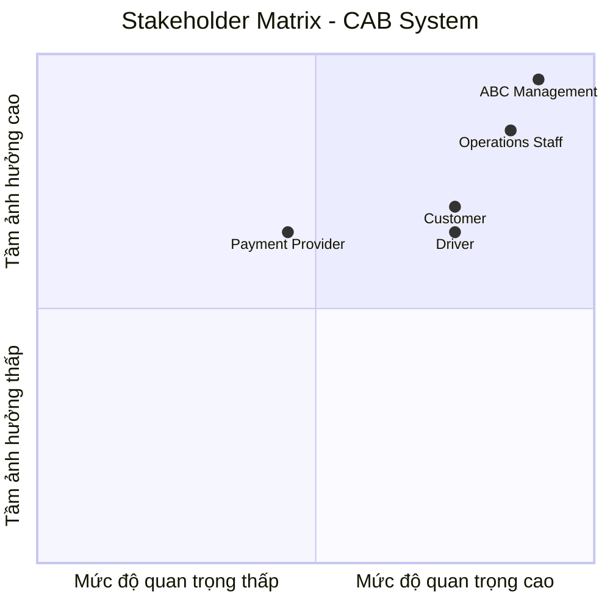
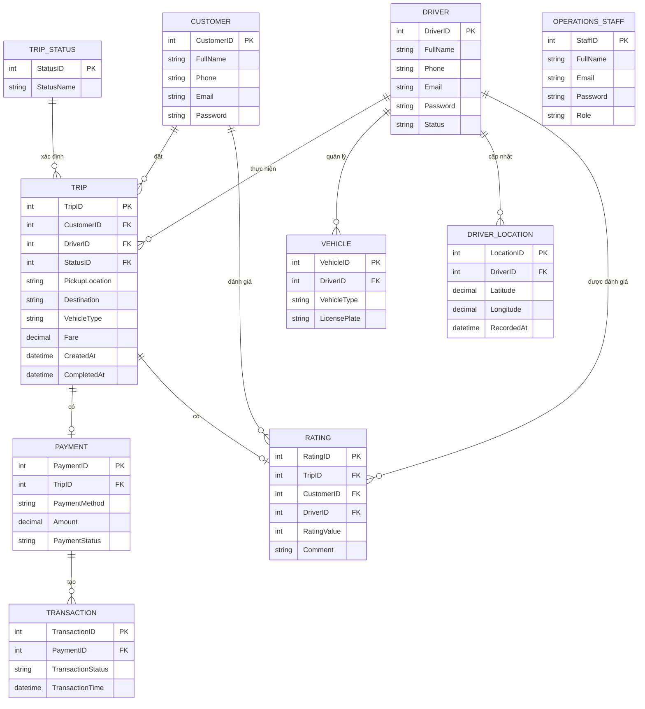
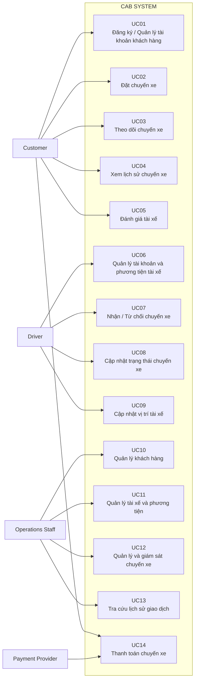

File mrd viết bằng markdown

Phân tích thiết kế hệ thống mvb, demo tối thiểu khách hàng

Bước 1: đọc và phân tích sơ khởi của khách hàng(Bussiness Contact) ngữ cảnh cửa nghiệp vụ

1. Bối cảnh nghiệp vụ

Công ty ABC là doanh nghiệp cung cấp dịch vụ đặt xe trực tuyến. Hiện tại, khách hàng có thể yêu cầu xe thông qua tổng đài hoặc một ứng dụng đơn giản. Tuy nhiên, hệ thống hiện tại còn một số hạn chế như việc phân công tài xế chủ yếu thực hiện thủ công, khách hàng khó theo dõi trạng thái chuyến đi, thông tin thanh toán chưa được quản lý tập trung và bộ phận vận hành gặp khó khăn khi mở rộng hệ thống. 

Công ty mong muốn xây dựng hệ thống CAB System – Nền tảng đặt xe nhằm hỗ trợ quá trình đặt xe, tìm và phân công tài xế, thực hiện chuyến đi, tính cước, thanh toán, thông báo và đánh giá sau chuyến. Hệ thống được xây dựng trong thời gian 7 tuần và hướng đến khả năng phục vụ số lượng lớn khách hàng, tài xế và có khả năng phát triển thêm trong tương lai.
2. Các tác nhân trong hệ thống
Hệ thống có 3 nhóm người dùng chính:

| Tác nhân | Vai trò |
|---|---|
| **Khách hàng** | Sử dụng hệ thống để đăng ký tài khoản, đặt xe, theo dõi chuyến đi, thanh toán, xem lịch sử và đánh giá tài xế. |
| **Tài xế** | Quản lý thông tin cá nhân, phương tiện, trạng thái hoạt động; nhận và thực hiện chuyến đi. |
| **Nhân viên vận hành** | Quản lý khách hàng, tài xế, phương tiện và chuyến đi; theo dõi hoạt động và hỗ trợ xử lý các trường hợp chuyến bị lỗi. |
Ba nhóm người dùng này được xác định trực tiếp từ yêu cầu của khách hàng.
3. Các nghiệp vụ chính

3.1. Quản lý tài khoản
Khách hàng có thể đăng ký tài khoản, đăng nhập và cập nhật thông tin cá nhân.
Tài xế có thể đăng ký hoặc được nhân viên vận hành tạo tài khoản, sau đó cập nhật hồ sơ, thông tin phương tiện và trạng thái hoạt động. 

3.2. Đặt xe
Khách hàng nhập điểm đón, điểm đến, lựa chọn loại xe và gửi yêu cầu đặt xe. Sau khi yêu cầu được gửi, hệ thống thực hiện quá trình tìm tài xế phù hợp. 

3.3. Tìm và phân công tài xế
Hệ thống xác định tài xế phù hợp dựa trên vị trí, trạng thái sẵn sàng và một số tiêu chí vận hành khác.

Tài xế được đề xuất nhận thông báo và có thể chấp nhận hoặc từ chối chuyến. Nếu tài xế không phản hồi hoặc từ chối, hệ thống tiếp tục tìm tài xế khác. Trường hợp không tìm được tài xế, khách hàng được thông báo rõ ràng. 

3.4. Thực hiện và theo dõi chuyến đi

Trong quá trình thực hiện chuyến, tài xế cập nhật các trạng thái:
- Đã đến điểm đón.
- Đã đón khách.
- Đang di chuyển.
- Hoàn thành chuyến.

Khách hàng có thể theo dõi trạng thái chuyến đi, tài xế đã nhận chuyến và thời gian dự kiến tài xế đến. Hệ thống cũng lưu thông tin vị trí của tài xế để hỗ trợ việc tìm tài xế gần khách hàng và cải thiện khả năng dự kiến thời gian đến. 

3.5. Tính cước và thanh toán

Sau khi chuyến đi hoàn thành, hệ thống xác định số tiền khách hàng phải trả dựa trên loại dịch vụ và thông tin chuyến đi.

Khách hàng có thể thanh toán bằng tiền mặt hoặc phương thức thanh toán điện tử. Hệ thống tích hợp với nhà cung cấp thanh toán bên ngoài và không lưu trực tiếp thông tin nhạy cảm của thẻ hoặc tài khoản thanh toán. Khi thanh toán điện tử thất bại, khách hàng được thông báo và có thể xử lý lại theo chính sách của doanh nghiệp. 

3.6. Thông báo

Khách hàng nhận được thông báo khi:

- Yêu cầu đặt xe được tiếp nhận.
- Có tài xế nhận chuyến.
- Tài xế đến điểm đón.
- Chuyến đi hoàn thành.
- Thanh toán có kết quả.

Tài xế nhận thông báo về các chuyến mới hoặc những thay đổi liên quan đến chuyến đang thực hiện. 

3.7. Lịch sử và đánh giá

Khách hàng có thể xem lịch sử chuyến đi, số tiền phải trả và đánh giá tài xế sau khi chuyến đi hoàn thành. 

3.8. Quản lý vận hành

Nhân viên vận hành có giao diện quản trị để quản lý:

- Khách hàng.
- Tài xế.
- Phương tiện.
- Chuyến đi.

Ngoài ra, nhân viên có thể xem các chuyến đang diễn ra, kiểm tra trạng thái tài xế, hỗ trợ xử lý các trường hợp chuyến bị lỗi và tra cứu lịch sử giao dịch. Một số chức năng quản trị được phân quyền để kiểm soát các thao tác nhạy cảm.

4. Phạm vi hệ thống

4.1. Phạm vi chức năng

CAB System tập trung vào các nghiệp vụ chính:
- Quản lý tài khoản khách hàng và tài xế.
- Đặt xe.
- Tìm và phân công tài xế.
- Thực hiện và theo dõi chuyến đi.
- Tính cước.
- Thanh toán.
- Thông báo.
- Xem lịch sử chuyến đi và đánh giá tài xế.
- Quản lý hoạt động vận hành.

4.2. Phạm vi yêu cầu phi chức năng
Hệ thống có các yêu cầu về:
- Khả năng mở rộng: các thành phần có khả năng mở rộng độc lập khi tải tăng.
- Tính ổn định: lỗi ở chức năng thanh toán hoặc thông báo không làm toàn bộ hệ thống đặt xe ngừng hoạt động.
- Khả năng triển khai: các chức năng mới có thể được triển khai từng phần và hạn chế ảnh hưởng đến các chức năng đang hoạt động.
- Bảo mật: xác thực người dùng, kiểm soát quyền truy cập và bảo vệ thông tin cá nhân, phương tiện, vị trí và giao dịch.
- Lưu vết: lưu lại các thao tác quan trọng để phục vụ kiểm tra khi có sự cố.

5. Các vấn đề cần làm rõ
Một số nội dung nghiệp vụ hiện chưa được khách hàng xác định cụ thể:

| Nội dung | Trạng thái |
|---|---|
| Cách tính cước | Chưa xác định |
| Tiêu chí ưu tiên tài xế | Chưa xác định |
| Thời gian tài xế phải phản hồi | Chưa xác định |
| Chính sách hủy chuyến | Chưa xác định |
| Cách xử lý khi mất kết nối mạng | Chưa xác định |
| Thời gian lưu trữ dữ liệu | Chưa xác định |
6. Kết quả phân tích Business Context

CAB System là nền tảng đặt xe của Công ty ABC, phục vụ ba nhóm người dùng chính gồm Khách hàng, Tài xế và Nhân viên vận hành.

Quy trình nghiệp vụ trung tâm của hệ thống gồm:

Đặt xe → Tìm tài xế → Nhận chuyến → Thực hiện chuyến → Hoàn thành → Tính cước → Thanh toán → Đánh giá

Hệ thống đồng thời hỗ trợ thông báo, quản lý lịch sử chuyến đi và các hoạt động vận hành. Các yêu cầu về khả năng mở rộng, tính ổn định, bảo mật và triển khai từng phần là những định hướng quan trọng cho quá trình phân tích và thiết kế hệ thống.

Bước 2:Phải xác định stakeholder trong bài. làm 1 bảng gồm 2 cột. Cột 1 là tên stake cột 2 là vai trò(ví dụ: stake:customer vai trò: đặt xe). Vẽ ma trận stakeholder matrix cho biết tầm ảnh hưởng quan trọng của stake trong hệ thống(vẽ bằng công cụ Mermaid dùng vẽ lượt đồ trong markdown).

2.1. Danh sách Stakeholder
| Stakeholder | Vai trò |
|---|---|
| **Customer** | Đăng ký tài khoản, đặt xe, theo dõi chuyến đi, thanh toán, xem lịch sử và đánh giá tài xế. |
| **Driver** | Quản lý hồ sơ, phương tiện và trạng thái hoạt động; nhận, từ chối và thực hiện chuyến. |
| **Operations Staff** | Quản lý khách hàng, tài xế, phương tiện và chuyến đi; theo dõi và hỗ trợ xử lý các chuyến bị lỗi. |
| **ABC Management** | Định hướng yêu cầu hệ thống, theo dõi hoạt động thông qua các báo cáo về chuyến đi, doanh thu, tỷ lệ hoàn thành, tỷ lệ hủy và hiệu quả hoạt động của tài xế. |
| **Payment Provider** | Cung cấp dịch vụ thanh toán điện tử bên ngoài và xử lý giao dịch thanh toán cho hệ thống CAB. |

2.2. Stakeholder Matrix

Phân loại
| Nhóm | Stakeholder |
|---|---|
| **Ảnh hưởng cao – Quan trọng cao** | ABC Management, Operations Staff |
| **Ảnh hưởng khá cao – Quan trọng cao** | Customer, Driver |
| **Ảnh hưởng trung bình – Quan trọng trung bình** | Payment Provider |

Bước 3: Xác đinh bussines goal mà mình thấy (ví dụ: bussiness goal là BG01: Giảm thời gian tìm tài xế) mục đích là hệ thống có chức năng tự động tìm tài xế (ví dụ 2: BG02: Cho phép thanh toán bằng tiền mặt và trực tuyến).

XÁC ĐỊNH BUSINESS GOAL

Dựa trên yêu cầu của khách hàng, các Business Goal được xác định từ những vấn đề và mong muốn mà Công ty ABC đặt ra cho CAB System.

| Mã | Business Goal | Mục đích của hệ thống |
|---|---|---|
| **BG01** | **Tự động hóa việc tìm và phân công tài xế** | Hệ thống tự động xác định tài xế phù hợp, gửi yêu cầu nhận chuyến và tiếp tục tìm tài xế khác khi tài xế không phản hồi hoặc từ chối. |
| **BG02** | **Nâng cao khả năng theo dõi chuyến đi** | Hệ thống cho phép khách hàng theo dõi tài xế đã nhận chuyến, thời gian dự kiến đến và trạng thái hiện tại của chuyến đi. |
| **BG03** | **Quản lý tập trung việc tính cước và thanh toán** | Hệ thống xác định số tiền phải trả sau chuyến và hỗ trợ thanh toán bằng tiền mặt hoặc phương thức thanh toán điện tử. |
| **BG04** | **Cung cấp thông báo kịp thời trong quá trình đặt và thực hiện chuyến** | Hệ thống gửi thông báo cho khách hàng và tài xế khi có các sự kiện liên quan đến chuyến đi và thanh toán. |
| **BG05** | **Nâng cao khả năng quản lý và theo dõi hoạt động vận hành** | Hệ thống hỗ trợ nhân viên vận hành quản lý khách hàng, tài xế, phương tiện, chuyến đi và tra cứu lịch sử giao dịch. |
| **BG06** | **Nâng cao khả năng mở rộng của hệ thống** | Hệ thống cho phép các thành phần mở rộng độc lập khi tải tăng và hỗ trợ triển khai chức năng mới từng phần. |

Bước 4: Xác định phạm vi yêu cầu cần phải làm(Scope). Ví dụ: Quản lý khách hàng, quản lý tài xế. Trong Scope phải liệt kê các yêu cầu cần phải làm cho hệ thống dưới gốc độ là 1 bản hệ thống mvb. Những cái nào tôi không nên làm trong đây 

4.1. Phạm vi hệ thống

Đối với bản MVP/MVB của CAB System, phạm vi nên tập trung vào quy trình đặt và hoàn thành một chuyến xe, bao gồm:                                                                   |
| STT | Scope | Yêu cầu cần thực hiện |
|---:|---|---|
| **1** | **Quản lý khách hàng** | Đăng ký tài khoản, đăng nhập và cập nhật thông tin cá nhân. |
| **2** | **Quản lý tài xế** | Đăng ký hoặc tạo tài khoản tài xế, cập nhật hồ sơ và trạng thái hoạt động. |
| **3** | **Quản lý phương tiện** | Quản lý thông tin phương tiện của tài xế. |
| **4** | **Đặt xe** | Nhập điểm đón, điểm đến, lựa chọn loại xe và gửi yêu cầu đặt xe. |
| **5** | **Tìm và phân công tài xế** | Xác định tài xế phù hợp dựa trên vị trí và trạng thái sẵn sàng; xử lý trường hợp tài xế từ chối hoặc không phản hồi. |
| **6** | **Quản lý chuyến đi** | Theo dõi chuyến và cập nhật các trạng thái: đã đến điểm đón, đã đón khách, đang di chuyển và hoàn thành. |
| **7** | **Tính cước** | Xác định số tiền khách hàng phải trả dựa trên loại dịch vụ và thông tin chuyến đi. |
| **8** | **Thanh toán** | Hỗ trợ thanh toán bằng tiền mặt và phương thức thanh toán điện tử; xử lý kết quả thanh toán. |
| **9** | **Thông báo** | Thông báo các trạng thái quan trọng của yêu cầu đặt xe, chuyến đi và thanh toán cho khách hàng, tài xế. |
| **10** | **Lịch sử và đánh giá** | Cho phép khách hàng xem lịch sử chuyến đi, số tiền phải trả và đánh giá tài xế sau chuyến. |
| **11** | **Quản lý vận hành** | Quản lý khách hàng, tài xế, phương tiện, chuyến đi; xem chuyến đang diễn ra, trạng thái tài xế và tra cứu lịch sử giao dịch. |

4.2. Những nội dung chưa xác định chi tiết trong phạm vi MVB
Trong quá trình phân tích, một số nội dung nghiệp vụ đã được khách hàng xác định là cần có nhưng chưa chốt chi tiết. Các nội dung này vẫn thuộc phạm vi nghiệp vụ của MVB, nhưng chưa đủ thông tin để xác định quy tắc triển khai cụ thể.

| Nội dung | Trạng thái trong MVB |
|---|---|
| **Công thức tính cước chi tiết** | Chưa xác định công thức cụ thể; MVB chỉ xác định số tiền phải trả dựa trên loại dịch vụ và thông tin chuyến đi. |
| **Tiêu chí ưu tiên tài xế chi tiết** | Chưa xác định tiêu chí ưu tiên cụ thể; MVB chỉ xác định tài xế dựa trên vị trí, trạng thái sẵn sàng và tiêu chí vận hành. |
| **Thời gian tài xế phải phản hồi** | Chưa xác định thời gian phản hồi cụ thể. |
| **Chính sách hủy chuyến** | Chưa xác định chính sách hủy chuyến. |
| **Xử lý khi mất kết nối mạng** | Chưa xác định cơ chế xử lý cụ thể khi mất kết nối mạng. |
| **Thời gian lưu trữ dữ liệu** | Chưa xác định thời gian lưu trữ dữ liệu. |
| **Nhiều nhà cung cấp thanh toán** | MVB sử dụng nhà cung cấp thanh toán bên ngoài theo yêu cầu hiện tại; khả năng bổ sung nhà cung cấp khác được dành cho giai đoạn sau. |
| **Nhiều nhà cung cấp thông báo** | MVB triển khai chức năng thông báo theo yêu cầu hiện tại; khả năng bổ sung nhà cung cấp khác được dành cho giai đoạn sau. |
| **Các loại dịch vụ CAB mới** | Chưa mở rộng trong MVB; khả năng bổ sung loại dịch vụ mới được dành cho giai đoạn sau. |

Bước 5: Chuyển những yêu cầu thành Bussiness requirement. Mỗi Bussiness requirement ký hiệu là BR (ví dụ: BR01 là đặt chuyển xe). Phải thiết kế diễn giải có 3 cột cột đầu là BR cột 2 là tên BR cột 3 là diễn giải(Cho phép khách hàng đặt xe, cung cấp điểm đến).

5. Các yêu cầu Business Requirement (BR) 

| BR | Tên BR | Diễn giải |
|---|---|---|
| **BR01** | **Quản lý tài khoản khách hàng** | Cho phép khách hàng đăng ký tài khoản, đăng nhập và cập nhật thông tin cá nhân. |
| **BR02** | **Quản lý tài xế và phương tiện** | Cho phép tài xế đăng ký hoặc được nhân viên vận hành tạo tài khoản, cập nhật hồ sơ, thông tin phương tiện và trạng thái hoạt động. |
| **BR03** | **Đặt chuyến xe** | Cho phép khách hàng cung cấp điểm đón, điểm đến, lựa chọn loại xe và gửi yêu cầu đặt xe. |
| **BR04** | **Tìm và phân công tài xế** | Cho phép hệ thống tìm tài xế phù hợp dựa trên vị trí, trạng thái sẵn sàng và các tiêu chí vận hành. |
| **BR05** | **Tiếp nhận và thực hiện chuyến xe** | Cho phép tài xế nhận hoặc từ chối chuyến và cập nhật trạng thái chuyến gồm đã đến điểm đón, đã đón khách, đang di chuyển và hoàn thành chuyến. |
| **BR06** | **Theo dõi chuyến xe** | Cho phép khách hàng theo dõi tài xế đã nhận chuyến, thời gian dự kiến tài xế đến và trạng thái hiện tại của chuyến đi. |
| **BR07** | **Tính cước chuyến xe** | Cho phép hệ thống xác định số tiền khách hàng phải trả dựa trên loại dịch vụ và thông tin chuyến đi. |
| **BR08** | **Thanh toán chuyến xe** | Cho phép khách hàng thanh toán bằng tiền mặt hoặc phương thức thanh toán điện tử thông qua nhà cung cấp thanh toán bên ngoài. |
| **BR09** | **Thông báo** | Cho phép hệ thống gửi thông báo cho khách hàng và tài xế về các sự kiện liên quan đến yêu cầu đặt xe, chuyến đi và kết quả thanh toán. |
| **BR10** | **Lịch sử và đánh giá chuyến xe** | Cho phép khách hàng xem lịch sử chuyến đi, số tiền phải trả và đánh giá tài xế sau khi chuyến xe hoàn thành. |
| **BR11** | **Quản lý vận hành** | Cho phép nhân viên vận hành quản lý khách hàng, tài xế, phương tiện và chuyến đi; theo dõi các chuyến đang diễn ra, kiểm tra trạng thái tài xế, hỗ trợ xử lý chuyến bị lỗi và tra cứu lịch sử giao dịch. |

Bước 6: Xây dựng đến các Bussiness process. ví dụ: Khách hàng đặt chuyến thì họ tạo chuyển đi rồi xác nhận điểm đoán rồi hệ thống xác nhận rồi thanh toán rồi tìm tài xế rồi đợi tài xế chấp nhận

6. BUSINESS PROCESS — BẢN ĐÃ RÀ SOÁT

BP01. Quản lý tài khoản khách hàng

Khách hàng → Đăng ký tài khoản → Đăng nhập → Cập nhật thông tin cá nhân

BP02. Quản lý tài xế và phương tiện

Tài xế/Nhân viên vận hành → Đăng ký hoặc tạo tài khoản tài xế → Cập nhật hồ sơ → Cập nhật thông tin phương tiện → Cập nhật trạng thái hoạt động

Tài xế có thể chuyển sang trạng thái sẵn sàng nhận chuyến khi đang làm việc. 

BP03. Đặt chuyến và tìm tài xế

Khách hàng → Nhập điểm đón → Nhập điểm đến → Chọn loại xe → Gửi yêu cầu đặt xe → Hệ thống tiếp nhận yêu cầu → Hệ thống thông báo trạng thái đang tìm tài xế → Hệ thống tìm tài xế phù hợp → Gửi yêu cầu nhận chuyến đến tài xế → Tài xế nhận hoặc từ chối chuyến

Nếu tài xế không phản hồi hoặc từ chối → Hệ thống tiếp tục tìm tài xế khác.

Nếu không tìm được tài xế → Thông báo cho khách hàng.

BP04. Thực hiện và theo dõi chuyến xe

Tài xế nhận chuyến → Đến điểm đón → Cập nhật “Đã đến điểm đón” → Đón khách → Cập nhật “Đã đón khách” → Di chuyển → Cập nhật “Đang di chuyển” → Hoàn thành chuyến

Khách hàng theo dõi tài xế đã nhận chuyến, thời gian dự kiến tài xế đến và trạng thái hiện tại của chuyến. 

BP05. Tính cước và thanh toán

Chuyến xe hoàn thành → Hệ thống xác định số tiền phải trả → Khách hàng thanh toán → Tiền mặt hoặc thanh toán điện tử → Hệ thống nhận kết quả thanh toán → Thông báo kết quả

Nếu thanh toán điện tử thất bại, hệ thống thông báo cho khách hàng và cho phép xử lý lại theo chính sách của doanh nghiệp. 

BP06. Thông báo

Phát sinh sự kiện → Hệ thống gửi thông báo đến đối tượng liên quan

Các sự kiện gồm:
- Yêu cầu đặt xe được tiếp nhận.
- Tài xế nhận chuyến.
- Tài xế đến điểm đón.
- Chuyến đi hoàn thành.
- Thanh toán có kết quả.
- Chuyến mới hoặc thay đổi liên quan đến chuyến đang thực hiện đối với tài xế.

BP07. Lịch sử và đánh giá chuyến xe

Chuyến xe hoàn thành → Khách hàng xem lịch sử chuyến đi và số tiền phải trả → Khách hàng đánh giá tài xế

Các chức năng này được nêu trực tiếp trong yêu cầu khách hàng. 

BP08. Quản lý vận hành

Nhân viên vận hành → Quản lý khách hàng → Quản lý tài xế → Quản lý phương tiện → Quản lý chuyến đi → Xem chuyến đang diễn ra → Kiểm tra trạng thái tài xế → Hỗ trợ xử lý chuyến bị lỗi → Tra cứu lịch sử giao dịch

Bước 7: Thiết kế phân rả yêu cầu nghiệp vụ từ BR (mã viết tắt Funtional Requerement là FR). Ví dụ FR01: Tìm tài xế. FR02: Chọn những  tài xế online. FR03: chọn loại xe. FR04: Chọn tài xế có đánh giá cao. Lưu ý đọc vào yêu cầu có thì mới đưa vô các ví dụ chỉ là gợi ý chưa chắc có trong yêu cầu

7.1. Phân rã BR → FR
| BR | Functional Requirement | Tên FR | Diễn giải |
|---|---|---|---|
| **BR01** | **FR01** | Đăng ký tài khoản khách hàng | Cho phép khách hàng đăng ký tài khoản để sử dụng hệ thống. |
| **BR01** | **FR02** | Đăng nhập khách hàng | Cho phép khách hàng đăng nhập vào hệ thống. |
| **BR01** | **FR03** | Cập nhật thông tin cá nhân | Cho phép khách hàng cập nhật thông tin cá nhân. |
| **BR02** | **FR04** | Quản lý hồ sơ tài xế | Cho phép tài xế đăng ký hoặc được nhân viên vận hành tạo tài khoản và cập nhật hồ sơ. |
| **BR02** | **FR05** | Quản lý phương tiện | Cho phép quản lý thông tin phương tiện của tài xế. |
| **BR02** | **FR06** | Cập nhật trạng thái hoạt động | Cho phép tài xế cập nhật trạng thái hoạt động và chuyển sang trạng thái sẵn sàng nhận chuyến. |
| **BR03** | **FR07** | Nhập thông tin chuyến xe | Cho phép khách hàng cung cấp điểm đón, điểm đến và lựa chọn loại xe khi đặt chuyến. |
| **BR03** | **FR08** | Gửi yêu cầu đặt xe | Cho phép khách hàng gửi yêu cầu đặt xe đến hệ thống. |
| **BR04** | **FR09** | Tìm tài xế phù hợp | Cho phép hệ thống tìm tài xế phù hợp dựa trên vị trí, trạng thái sẵn sàng và các tiêu chí vận hành. |
| **BR04** | **FR10** | Gửi yêu cầu nhận chuyến | Cho phép hệ thống gửi yêu cầu chuyến xe đến tài xế phù hợp. |
| **BR04** | **FR11** | Xử lý tài xế không nhận chuyến | Cho phép hệ thống tiếp tục tìm tài xế khác khi tài xế được đề xuất không phản hồi hoặc từ chối chuyến. |
| **BR04** | **FR12** | Thông báo không tìm được tài xế | Cho phép hệ thống thông báo cho khách hàng khi không tìm được tài xế. |
| **BR05** | **FR13** | Chấp nhận chuyến | Cho phép tài xế chấp nhận chuyến được hệ thống đề xuất. |
| **BR05** | **FR14** | Từ chối chuyến | Cho phép tài xế từ chối chuyến được hệ thống đề xuất. |
| **BR05** | **FR15** | Cập nhật trạng thái chuyến | Cho phép tài xế cập nhật trạng thái đã đến điểm đón, đã đón khách, đang di chuyển và hoàn thành chuyến. |
| **BR06** | **FR16** | Theo dõi trạng thái chuyến | Cho phép khách hàng theo dõi trạng thái hiện tại của chuyến xe. |
| **BR06** | **FR17** | Xem thông tin tài xế | Cho phép khách hàng biết tài xế nào đã nhận chuyến. |
| **BR06** | **FR18** | Xem thời gian dự kiến tài xế đến | Cho phép khách hàng xem thời gian dự kiến tài xế đến điểm đón. |
| **BR07** | **FR19** | Tính số tiền phải trả | Cho phép hệ thống xác định số tiền khách hàng phải trả sau khi chuyến xe hoàn thành dựa trên loại dịch vụ và thông tin chuyến đi. |
| **BR08** | **FR20** | Thanh toán tiền mặt | Cho phép khách hàng thanh toán chuyến xe bằng tiền mặt. |
| **BR08** | **FR21** | Thanh toán điện tử | Cho phép khách hàng thanh toán điện tử thông qua nhà cung cấp thanh toán bên ngoài. |
| **BR08** | **FR22** | Xử lý thanh toán thất bại | Cho phép hệ thống thông báo khi thanh toán điện tử thất bại và hỗ trợ xử lý lại theo chính sách của doanh nghiệp. |
| **BR09** | **FR23** | Gửi thông báo | Cho phép hệ thống gửi thông báo cho khách hàng và tài xế khi phát sinh các sự kiện liên quan đến yêu cầu đặt xe, chuyến xe và thanh toán. |
| **BR10** | **FR24** | Xem lịch sử chuyến xe | Cho phép khách hàng xem lịch sử chuyến đi và số tiền phải trả. |
| **BR10** | **FR25** | Đánh giá tài xế | Cho phép khách hàng đánh giá tài xế sau khi chuyến xe hoàn thành. |
| **BR11** | **FR26** | Quản lý khách hàng | Cho phép nhân viên vận hành quản lý thông tin khách hàng. |
| **BR11** | **FR27** | Quản lý tài xế | Cho phép nhân viên vận hành quản lý thông tin tài xế. |
| **BR11** | **FR28** | Quản lý phương tiện | Cho phép nhân viên vận hành quản lý thông tin phương tiện. |
| **BR11** | **FR29** | Quản lý chuyến đi | Cho phép nhân viên vận hành quản lý thông tin và trạng thái chuyến đi. |
| **BR11** | **FR30** | Xem chuyến đang diễn ra | Cho phép nhân viên vận hành xem các chuyến đang diễn ra. |
| **BR11** | **FR31** | Kiểm tra trạng thái tài xế | Cho phép nhân viên vận hành kiểm tra trạng thái của tài xế. |
| **BR11** | **FR32** | Hỗ trợ xử lý chuyến bị lỗi | Cho phép nhân viên vận hành hỗ trợ xử lý các trường hợp chuyến bị lỗi. |
| **BR11** | **FR33** | Tra cứu lịch sử giao dịch | Cho phép nhân viên vận hành tra cứu lịch sử giao dịch. |
| **BR01–BR11** | **FR34** | Xác thực người dùng | Cho phép hệ thống xác thực khách hàng và tài xế trước khi sử dụng các chức năng yêu cầu tài khoản. |
| **BR01–BR11** | **FR35** | Phân quyền quản trị | Cho phép hệ thống kiểm soát quyền truy cập đối với các thao tác quản trị. |

Bước 8: Bước 8: Xây dựng Business Rule và Acceptance. ví dụ bussiness role: Những tài xế trong tạng thái available thì mới được bắt chuyển. Ví dụ acception: Khi khách hàng đợi lâu không có tài xế thì phải làm sao. 

8.1. Business Rule

| Mã | Business Rule | Diễn giải |
|---|---|---|
| **BRL01** | **Chỉ tài xế sẵn sàng mới được xem xét nhận chuyến** | Hệ thống chỉ xem xét các tài xế đang ở trạng thái sẵn sàng khi tìm tài xế cho khách hàng. |
| **BRL02** | **Tài xế phải phù hợp với yêu cầu chuyến** | Hệ thống xác định tài xế phù hợp dựa trên vị trí, trạng thái sẵn sàng và các tiêu chí vận hành. |
| **BRL03** | **Tiếp tục tìm tài xế khi tài xế từ chối** | Nếu tài xế được đề xuất từ chối chuyến, hệ thống phải tiếp tục tìm tài xế khác mà khách hàng không cần đặt lại chuyến. |
| **BRL04** | **Tiếp tục tìm tài xế khi tài xế không phản hồi** | Nếu tài xế được đề xuất không phản hồi, hệ thống phải tiếp tục tìm tài xế khác. |
| **BRL05** | **Thông báo khi không tìm được tài xế** | Nếu không tìm được tài xế phù hợp, hệ thống phải thông báo rõ ràng cho khách hàng. |
| **BRL06** | **Không lưu thông tin thanh toán nhạy cảm trực tiếp trong CAB** | Thông tin nhạy cảm của thẻ hoặc tài khoản thanh toán không được lưu trực tiếp trong hệ thống CAB. |
| **BRL07** | **Thanh toán điện tử thông qua nhà cung cấp bên ngoài** | Khi khách hàng chọn thanh toán điện tử, CAB sử dụng nhà cung cấp thanh toán bên ngoài để xử lý giao dịch. |
| **BRL08** | **Chuyến phải hoàn thành trước khi xác định số tiền phải trả** | Sau khi chuyến đi hoàn thành, hệ thống xác định số tiền khách hàng phải trả dựa trên loại dịch vụ và thông tin chuyến đi. |
| **BRL09** | **Thao tác quản trị phải được kiểm soát quyền** | Các chức năng quản trị phải được kiểm soát quyền truy cập, chỉ nhân viên có quyền mới được thực hiện thao tác tương ứng. |
| **BRL10** | **Các thao tác quan trọng phải được lưu vết** | Hệ thống phải lưu lại các thao tác quan trọng để phục vụ kiểm tra và xử lý khi xảy ra sự cố. |

Các rule trên được thể hiện trực tiếp hoặc suy ra rất gần từ yêu cầu về tìm tài xế, thanh toán và bảo mật trong tài liệu.

8.2. Acceptance Criteria
Ở đây Acceptance nên hiểu là điều kiện để xác nhận hệ thống đã đáp ứng yêu cầu nghiệp vụ.

| AC | Business Requirement | Tiêu chí chấp nhận |
|---|---|---|
| **AC01** | **BR01 – Quản lý tài khoản khách hàng** | Khách hàng đăng ký thành công thì tài khoản được tạo; khách hàng có thể đăng nhập và cập nhật thông tin cá nhân. |
| **AC02** | **BR02 – Quản lý tài xế và phương tiện** | Tài xế có thể cập nhật hồ sơ, thông tin phương tiện và trạng thái hoạt động; thông tin được hệ thống lưu lại. |
| **AC03** | **BR03 – Đặt chuyến xe** | Khi khách hàng nhập điểm đón, điểm đến, loại xe và gửi yêu cầu, hệ thống tiếp nhận và tạo yêu cầu đặt chuyến. |
| **AC04** | **BR04 – Tìm và phân công tài xế** | Hệ thống tìm tài xế phù hợp dựa trên vị trí, trạng thái sẵn sàng và tiêu chí vận hành. Nếu tài xế từ chối hoặc không phản hồi, hệ thống tiếp tục tìm tài xế khác. Nếu không tìm được tài xế phù hợp, hệ thống thông báo cho khách hàng. |
| **AC05** | **BR05 – Tiếp nhận và thực hiện chuyến xe** | Tài xế có thể nhận hoặc từ chối chuyến và cập nhật các trạng thái: đã đến điểm đón, đã đón khách, đang di chuyển và hoàn thành chuyến. |
| **AC06** | **BR06 – Theo dõi chuyến xe** | Khách hàng có thể xem trạng thái chuyến, tài xế đã nhận chuyến và thời gian dự kiến tài xế đến khi có thông tin. |
| **AC07** | **BR07 – Tính cước chuyến xe** | Khi chuyến xe hoàn thành, hệ thống xác định số tiền khách hàng phải trả dựa trên loại dịch vụ và thông tin chuyến đi. |
| **AC08** | **BR08 – Thanh toán chuyến xe** | Khách hàng có thể thanh toán bằng tiền mặt hoặc phương thức điện tử. Với thanh toán điện tử, hệ thống gửi giao dịch đến nhà cung cấp bên ngoài và nhận kết quả. Nếu thanh toán thất bại, hệ thống thông báo cho khách hàng và cho phép xử lý lại theo chính sách của doanh nghiệp. |
| **AC09** | **BR09 – Thông báo** | Khi xảy ra các sự kiện quan trọng như tiếp nhận yêu cầu, tài xế nhận chuyến, tài xế đến điểm đón, chuyến hoàn thành hoặc thanh toán có kết quả, hệ thống gửi thông báo tương ứng. |
| **AC10** | **BR10 – Lịch sử và đánh giá chuyến xe** | Khách hàng có thể xem lịch sử chuyến xe và số tiền phải trả; sau khi chuyến hoàn thành, khách hàng có thể đánh giá tài xế và hệ thống ghi nhận đánh giá. |
| **AC11** | **BR11 – Quản lý vận hành** | Nhân viên vận hành có quyền có thể quản lý khách hàng, tài xế, phương tiện và chuyến xe; xem chuyến đang diễn ra, kiểm tra trạng thái tài xế, hỗ trợ xử lý chuyến bị lỗi và tra cứu lịch sử giao dịch. |

Bước 9: Data modedling để xây dựng các data model từ đó xác định các thực thể để vẽ được sơ đồ ERD

9.1. Xác định các thực thể

| STT | Thực thể | Ý nghĩa trong nghiệp vụ |
|---|---|---|
| **E01** | **Customer** | Lưu thông tin khách hàng sử dụng dịch vụ đặt xe. |
| **E02** | **Driver** | Lưu thông tin tài xế tham gia nhận và thực hiện chuyến xe. |
| **E03** | **Vehicle** | Lưu thông tin phương tiện của tài xế. |
| **E04** | **Trip** | Lưu thông tin chuyến xe do khách hàng tạo và tài xế thực hiện. |
| **E05** | **Trip Status** | Lưu các trạng thái của chuyến xe trong quá trình thực hiện. |
| **E06** | **Payment** | Lưu thông tin và kết quả thanh toán của chuyến xe. |
| **E07** | **Transaction** | Lưu thông tin giao dịch phục vụ tra cứu lịch sử giao dịch. |
| **E08** | **Driver Location** | Lưu thông tin vị trí của tài xế để hỗ trợ tìm tài xế phù hợp và xác định thời gian dự kiến đến. |
| **E09** | **Rating** | Lưu đánh giá của khách hàng dành cho tài xế sau khi chuyến xe hoàn thành. |
| **E10** | **Operations Staff** | Lưu thông tin nhân viên vận hành sử dụng các chức năng quản trị hệ thống. |

9.2. Các thuộc tính chính của thực thể

| Thực thể | Thuộc tính chính |
|---|---|
| **Customer** | CustomerID, FullName, Phone, Email, Password |
| **Driver** | DriverID, FullName, Phone, Email, Password, Status |
| **Vehicle** | VehicleID, DriverID, VehicleType, LicensePlate |
| **Trip** | TripID, CustomerID, DriverID, StatusID, PickupLocation, Destination, VehicleType, Fare, CreatedAt, CompletedAt |
| **Trip Status** | StatusID, StatusName |
| **Payment** | PaymentID, TripID, PaymentMethod, Amount, PaymentStatus |
| **Transaction** | TransactionID, PaymentID, TransactionStatus, TransactionTime |
| **Driver Location** | LocationID, DriverID, Latitude, Longitude, RecordedAt |
| **Rating** | RatingID, TripID, CustomerID, DriverID, RatingValue, Comment |
| **Operations Staff** | StaffID, FullName, Email, Password, Role |

9.3. Sơ đồ ERD 

Bước 10: Xác định rồi tự thiết kế các nonfuntional requirement. ví dụ: hệ thống thiết kế mvb không quan tâm thời gian phản hồi dưới 1ms hoặc phải thiết kế theo kiến trúc microservice

| Mã | Non-functional Requirement | Yêu cầu |
|---|---|---|
| **NFR01** | **Khả năng mở rộng** | Hệ thống MVB phải có khả năng mở rộng khi số lượng khách hàng, tài xế và chuyến xe tăng lên. |
| **NFR02** | **Tính ổn định** | Hệ thống phải hoạt động ổn định trong quá trình khách hàng đặt xe và tài xế thực hiện chuyến xe. |
| **NFR03** | **Khả năng chịu lỗi** | Lỗi tại chức năng thanh toán hoặc thông báo không được làm toàn bộ chức năng đặt xe ngừng hoạt động. |
| **NFR04** | **Bảo mật dữ liệu** | Hệ thống phải bảo vệ thông tin cá nhân của khách hàng, tài xế, thông tin phương tiện, dữ liệu vị trí và dữ liệu giao dịch. |
| **NFR05** | **Xác thực người dùng** | Khách hàng và tài xế phải được xác thực trước khi sử dụng các chức năng yêu cầu tài khoản. |
| **NFR06** | **Phân quyền** | Các chức năng quản trị phải được kiểm soát quyền truy cập để nhân viên không có quyền không thể thực hiện các thao tác tương ứng. |
| **NFR07** | **Lưu vết hoạt động** | Hệ thống phải lưu vết các thao tác quan trọng để hỗ trợ kiểm tra khi xảy ra sự cố. |
| **NFR08** | **Khả năng tích hợp** | Hệ thống phải có khả năng tích hợp với nhà cung cấp thanh toán bên ngoài và các nhà cung cấp thông báo. |
| **NFR09** | **Khả năng mở rộng chức năng** | Hệ thống phải cho phép bổ sung loại dịch vụ, phương thức thanh toán hoặc nhà cung cấp thông báo mới với mức ảnh hưởng hạn chế đến các chức năng hiện có. |
| **NFR10** | **Triển khai từng phần** | Các chức năng mới có thể được triển khai từng phần và hạn chế ảnh hưởng đến các chức năng đang hoạt động. |

Bước 11-12: xác định có bao nhiêu usecase trong hệ thống và thiết kế các sơ đồ Usecase(Ký hiệu UC). Ví dụ Usecase 01 customer là UC01. Đặc tả Usecase. Bước 11 và bước 12 làm liên tục với nhau 

11.1. Danh sách Use Case

| Mã UC | Tên Use Case | Actor chính |
|---|---|---|
| **UC01** | Đăng ký/Quản lý tài khoản khách hàng | Customer |
| **UC02** | Đặt chuyến xe | Customer |
| **UC03** | Theo dõi chuyến xe | Customer |
| **UC04** | Xem lịch sử chuyến xe | Customer |
| **UC05** | Đánh giá tài xế | Customer |
| **UC06** | Quản lý tài khoản và phương tiện tài xế | Driver |
| **UC07** | Nhận/Từ chối chuyến xe | Driver |
| **UC08** | Cập nhật trạng thái chuyến xe | Driver |
| **UC09** | Cập nhật vị trí tài xế | Driver |
| **UC10** | Quản lý khách hàng | Operations Staff |
| **UC11** | Quản lý tài xế và phương tiện | Operations Staff |
| **UC12** | Quản lý và giám sát chuyến xe | Operations Staff |
| **UC13** | Tra cứu lịch sử giao dịch | Operations Staff |
| **UC14** | Thanh toán chuyến xe | Customer |

11.2. Use Case Diagram tổng thể

12. Đặc tả Use Case

UC01 – Đăng ký/Quản lý tài khoản khách hàng

| Thành phần | Nội dung |
|---|---|
| **Mã UC** | UC01 |
| **Tên** | Đăng ký/Quản lý tài khoản khách hàng |
| **Actor** | Customer |
| **Mục tiêu** | Cho phép khách hàng đăng ký, đăng nhập và cập nhật thông tin cá nhân. |
| **Tiền điều kiện** | Khách hàng chưa có tài khoản khi đăng ký; đã có tài khoản khi đăng nhập hoặc cập nhật thông tin. |
| **Luồng chính** | 1. Khách hàng chọn chức năng đăng ký hoặc đăng nhập. 2. Khách hàng nhập thông tin tài khoản. 3. Hệ thống xác thực thông tin tài khoản. 4. Khách hàng đăng nhập hoặc cập nhật thông tin cá nhân. |
| **Ngoại lệ** | Thông tin xác thực không hợp lệ → hệ thống không cho phép sử dụng các chức năng yêu cầu tài khoản. |
| **Kết quả** | Tài khoản khách hàng được tạo hoặc thông tin cá nhân được cập nhật. |

UC02 – Đặt chuyến xe

| Thành phần | Nội dung |
|---|---|
| **Mã UC** | UC02 |
| **Tên** | Đặt chuyến xe |
| **Actor** | Customer |
| **Mục tiêu** | Cho phép khách hàng tạo yêu cầu đặt xe. |
| **Tiền điều kiện** | Customer đã đăng nhập. |
| **Luồng chính** | 1. Khách hàng nhập điểm đón. 2. Khách hàng nhập điểm đến. 3. Khách hàng chọn loại xe. 4. Khách hàng gửi yêu cầu đặt xe. 5. Hệ thống tiếp nhận yêu cầu. 6. Hệ thống thông báo trạng thái đang tìm tài xế. 7. Hệ thống bắt đầu tìm tài xế phù hợp. |
| **Ngoại lệ** | Không tìm được tài xế phù hợp → hệ thống thông báo rõ ràng cho khách hàng. |
| **Kết quả** | Yêu cầu đặt xe được tạo và chuyển sang quá trình tìm tài xế. |

UC03 – Theo dõi chuyến xe

| Thành phần | Nội dung |
|---|---|
| **Mã UC** | UC03 |
| **Tên** | Theo dõi chuyến xe |
| **Actor** | Customer |
| **Mục tiêu** | Cho phép khách hàng theo dõi tình trạng chuyến xe. |
| **Tiền điều kiện** | Customer có chuyến xe. |
| **Luồng chính** | 1. Khách hàng chọn chuyến xe cần theo dõi. 2. Hệ thống hiển thị trạng thái hiện tại của chuyến. 3. Hệ thống hiển thị thông tin tài xế đã nhận chuyến. 4. Hệ thống hiển thị thời gian dự kiến tài xế đến khi có thông tin. |
| **Kết quả** | Khách hàng biết được tình trạng chuyến xe, tài xế và thời gian dự kiến đến. |

UC04 – Xem lịch sử chuyến xe

| Thành phần | Nội dung |
|---|---|
| **Mã UC** | UC04 |
| **Tên** | Xem lịch sử chuyến xe |
| **Actor** | Customer |
| **Mục tiêu** | Cho phép khách hàng xem lại lịch sử các chuyến xe. |
| **Tiền điều kiện** | Customer đã đăng nhập. |
| **Luồng chính** | 1. Khách hàng chọn chức năng lịch sử chuyến xe. 2. Hệ thống lấy dữ liệu lịch sử. 3. Hệ thống hiển thị danh sách các chuyến và số tiền phải trả. |
| **Kết quả** | Customer xem được lịch sử chuyến xe. |

UC05 – Đánh giá tài xế

| Thành phần | Nội dung |
|---|---|
| **Mã UC** | UC05 |
| **Tên** | Đánh giá tài xế |
| **Actor** | Customer |
| **Mục tiêu** | Cho phép khách hàng đánh giá tài xế sau khi chuyến hoàn thành. |
| **Tiền điều kiện** | Chuyến xe đã hoàn thành. |
| **Luồng chính** | 1. Customer chọn chuyến đã hoàn thành. 2. Chọn chức năng đánh giá tài xế. 3. Nhập đánh giá. 4. Gửi đánh giá. 5. Hệ thống lưu đánh giá. |
| **Kết quả** | Đánh giá tài xế được ghi nhận. |

UC06 – Quản lý tài khoản và phương tiện tài xế

| Thành phần | Nội dung |
|---|---|
| **Mã UC** | UC06 |
| **Tên** | Quản lý tài khoản và phương tiện tài xế |
| **Actor** | Driver |
| **Mục tiêu** | Cho phép tài xế quản lý thông tin cá nhân, phương tiện và trạng thái hoạt động. |
| **Tiền điều kiện** | Driver có tài khoản. |
| **Luồng chính** | 1. Driver đăng nhập. 2. Cập nhật thông tin cá nhân. 3. Cập nhật thông tin phương tiện. 4. Cập nhật trạng thái hoạt động. |
| **Kết quả** | Thông tin tài xế, phương tiện và trạng thái hoạt động được cập nhật. |

UC07 – Nhận/Từ chối chuyến xe

| Thành phần | Nội dung |
|---|---|
| **Mã UC** | UC07 |
| **Tên** | Nhận/Từ chối chuyến xe |
| **Actor** | Driver |
| **Mục tiêu** | Cho phép tài xế quyết định nhận hoặc từ chối chuyến xe được đề xuất. |
| **Tiền điều kiện** | Driver ở trạng thái sẵn sàng và nhận được yêu cầu chuyến phù hợp. |
| **Luồng chính** | 1. Hệ thống gửi yêu cầu chuyến đến tài xế. 2. Driver xem thông tin yêu cầu. 3. Driver chọn nhận hoặc từ chối. 4. Nếu nhận, hệ thống xác nhận tài xế nhận chuyến. |
| **Ngoại lệ** | Driver từ chối hoặc không phản hồi → hệ thống tiếp tục tìm tài xế khác. |
| **Kết quả** | Chuyến được tài xế nhận hoặc hệ thống tiếp tục tìm tài xế khác. |

UC08 – Cập nhật trạng thái chuyến xe

| Thành phần | Nội dung |
|---|---|
| **Mã UC** | UC08 |
| **Tên** | Cập nhật trạng thái chuyến xe |
| **Actor** | Driver |
| **Mục tiêu** | Cho phép tài xế cập nhật tiến trình thực hiện chuyến xe. |
| **Tiền điều kiện** | Driver đã nhận chuyến. |
| **Luồng chính** | 1. Driver cập nhật trạng thái đã đến điểm đón. 2. Cập nhật trạng thái đã đón khách. 3. Cập nhật trạng thái đang di chuyển. 4. Cập nhật trạng thái hoàn thành chuyến. |
| **Kết quả** | Trạng thái chuyến xe được cập nhật. |

UC09 – Cập nhật vị trí tài xế

| Thành phần | Nội dung |
|---|---|
| **Mã UC** | UC09 |
| **Tên** | Cập nhật vị trí tài xế |
| **Actor** | Driver |
| **Mục tiêu** | Cung cấp thông tin vị trí của tài xế cho hệ thống. |
| **Tiền điều kiện** | Driver đang hoạt động. |
| **Luồng chính** | 1.Hệ thống nhận thông tin vị trí của tài xế. 2. Hệ thống lưu thông tin vị trí. 3. Hệ thống sử dụng thông tin vị trí để hỗ trợ tìm tài xế phù hợp và xác định thời gian dự kiến đến. |
| **Kết quả** | Vị trí tài xế được cập nhật trong hệ thống. |

UC10 – Quản lý khách hàng

| Thành phần | Nội dung |
|---|---|
| **Mã UC** | UC10 |
| **Tên** | Quản lý khách hàng |
| **Actor** | Operations Staff |
| **Mục tiêu** | Cho phép nhân viên vận hành quản lý thông tin khách hàng. |
| **Tiền điều kiện** | Nhân viên đã được xác thực và có quyền thực hiện chức năng. |
| **Luồng chính** | 1. Nhân viên truy cập chức năng quản lý khách hàng. 2. Xem thông tin khách hàng. 3. Thực hiện thao tác quản lý được cấp quyền. |
| **Kết quả** | Thông tin khách hàng được quản lý. |

UC11 – Quản lý tài xế và phương tiện

| Thành phần | Nội dung |
|---|---|
| **Mã UC** | UC11 |
| **Tên** | Quản lý tài xế và phương tiện |
| **Actor** | Operations Staff |
| **Mục tiêu** | Cho phép nhân viên vận hành quản lý thông tin tài xế và phương tiện. |
| **Tiền điều kiện** | Nhân viên có quyền quản trị. |
| **Luồng chính** | 1. Nhân viên truy cập chức năng quản lý tài xế và phương tiện. 2. Xem thông tin tài xế/phương tiện. 3. Thực hiện thao tác quản lý được cấp quyền. |
| **Kết quả** | Thông tin tài xế và phương tiện được quản lý. |

UC12 – Quản lý và giám sát chuyến xe

| Thành phần | Nội dung |
|---|---|
| **Mã UC** | UC12 |
| **Tên** | Quản lý và giám sát chuyến xe |
| **Actor** | Operations Staff |
| **Mục tiêu** | Cho phép nhân viên vận hành theo dõi và hỗ trợ xử lý các chuyến xe. |
| **Tiền điều kiện** | Nhân viên đã được xác thực và có quyền thực hiện chức năng. |
| **Luồng chính** | 1. Nhân viên xem các chuyến đang diễn ra. 2. Kiểm tra trạng thái chuyến và trạng thái tài xế. 3. Hỗ trợ xử lý trường hợp chuyến xe bị lỗi. |
| **Kết quả** | Tình trạng chuyến xe được theo dõi và trường hợp lỗi được hỗ trợ xử lý. |

UC13 – Tra cứu lịch sử giao dịch

| Thành phần | Nội dung |
|---|---|
| **Mã UC** | UC13 |
| **Tên** | Tra cứu lịch sử giao dịch |
| **Actor** | Operations Staff |
| **Mục tiêu** | Cho phép nhân viên vận hành tra cứu lịch sử giao dịch. |
| **Tiền điều kiện** | Nhân viên có quyền truy cập chức năng. |
| **Luồng chính** | 1. Nhân viên chọn chức năng lịch sử giao dịch. 2. Hệ thống lấy dữ liệu giao dịch. 3. Hệ thống hiển thị lịch sử giao dịch. |
| **Kết quả** | Nhân viên xem được lịch sử giao dịch. |

UC14 – Thanh toán chuyến xe

| Thành phần | Nội dung |
|---|---|
| **Mã UC** | UC14 |
| **Tên** | Thanh toán chuyến xe |
| **Actor** | Customer |
| **Mục tiêu** | Cho phép khách hàng thanh toán số tiền của chuyến xe. |
| **Tiền điều kiện** | Chuyến xe đã hoàn thành và hệ thống đã xác định số tiền phải trả. |
| **Luồng chính** | 1. Hệ thống xác định số tiền phải trả. 2. Customer chọn phương thức thanh toán. 3. Nếu chọn tiền mặt, hệ thống ghi nhận thanh toán. 4. Nếu chọn thanh toán điện tử, hệ thống gửi yêu cầu đến nhà cung cấp thanh toán bên ngoài. 5. Hệ thống nhận kết quả giao dịch. |
| **Ngoại lệ** | Thanh toán điện tử thất bại → hệ thống thông báo cho khách hàng và cho phép xử lý lại theo chính sách của doanh nghiệp. |
| **Kết quả** | Kết quả thanh toán của chuyến xe được ghi nhận. |

Bước 13(quan trọng): Những tiêu chí chấp nhận thì những key trong đây ký hiệu AC. Mục đích bước này là để tập hợp các điều kiện quy tắc cụ thể mà tính năng đó phải đáp ứng mục đích là để cho người làm phần mền khi nào yêu cầu được kết thúc và nghiệm thu. Tự thiết kế các AC để cho biết khi nào các bussiness requement được kết thúc.

13. Bảng Acceptance Criteria

| AC | Business Requirement | Tiêu chí chấp nhận |
|---|---|---|
| **AC01** | **BR01 – Quản lý tài khoản khách hàng** | Khách hàng đăng ký thành công thì tài khoản được tạo; khách hàng có thể đăng nhập và cập nhật thông tin cá nhân. |
| **AC02** | **BR02 – Quản lý tài xế và phương tiện** | Tài xế có thể cập nhật hồ sơ, thông tin phương tiện và trạng thái hoạt động; thông tin được hệ thống lưu lại. |
| **AC03** | **BR03 – Đặt chuyến xe** | Khi khách hàng nhập điểm đón, điểm đến, loại xe và gửi yêu cầu, hệ thống tiếp nhận và tạo yêu cầu đặt chuyến. |
| **AC04** | **BR04 – Tìm và phân công tài xế** | Hệ thống tìm tài xế phù hợp dựa trên vị trí, trạng thái sẵn sàng và tiêu chí vận hành. Nếu tài xế từ chối hoặc không phản hồi, hệ thống tiếp tục tìm tài xế khác. Nếu không tìm được tài xế phù hợp, hệ thống thông báo cho khách hàng. |
| **AC05** | **BR05 – Tiếp nhận và thực hiện chuyến xe** | Tài xế có thể nhận hoặc từ chối chuyến và cập nhật các trạng thái: đã đến điểm đón, đã đón khách, đang di chuyển và hoàn thành chuyến. |
| **AC06** | **BR06 – Theo dõi chuyến xe** | Khách hàng có thể xem trạng thái chuyến, tài xế đã nhận chuyến và thời gian dự kiến tài xế đến khi có thông tin. |
| **AC07** | **BR07 – Tính cước chuyến xe** | Khi chuyến xe hoàn thành, hệ thống xác định số tiền khách hàng phải trả dựa trên loại dịch vụ và thông tin chuyến đi. |
| **AC08** | **BR08 – Thanh toán chuyến xe** | Khách hàng có thể thanh toán bằng tiền mặt hoặc phương thức điện tử. Với thanh toán điện tử, hệ thống gửi giao dịch đến nhà cung cấp bên ngoài và nhận kết quả. Nếu thanh toán thất bại, hệ thống thông báo cho khách hàng và cho phép xử lý lại theo chính sách của doanh nghiệp. |
| **AC09** | **BR09 – Thông báo** | Khi xảy ra các sự kiện quan trọng như tiếp nhận yêu cầu, tài xế nhận chuyến, tài xế đến điểm đón, chuyến hoàn thành hoặc thanh toán có kết quả, hệ thống gửi thông báo tương ứng. |
| **AC10** | **BR10 – Lịch sử và đánh giá chuyến xe** | Khách hàng có thể xem lịch sử chuyến xe và số tiền phải trả; sau khi chuyến hoàn thành, khách hàng có thể đánh giá tài xế và hệ thống ghi nhận đánh giá. |
| **AC11** | **BR11 – Quản lý vận hành** | Nhân viên vận hành có quyền có thể quản lý khách hàng, tài xế, phương tiện và chuyến xe; xem chuyến đang diễn ra, kiểm tra trạng thái tài xế, hỗ trợ xử lý chuyến bị lỗi và tra cứu lịch sử giao dịch. |

Bước 14: TTruy xuất nguồn gốc yêu cầu - quá trình theo dõi yêu cầu bắt dâu khi nào thiết kế thế nào cho tới biết kiểm thử.Tạo bảng ma trận truy xuất yêu cầu RTM. trong bảng có những cột cột 1 BG, cột 2 BR, cột 3 FR, cột 4 UC, cột 5 AC
RTM (Requirements Traceability Matrix – Ma trận truy xuất yêu cầu) dùng để theo dõi một yêu cầu từ Business Goal (BG) → Business Requirement (BR) → Functional Requirement (FR) → Use Case (UC) → Acceptance Criteria (AC).

Với CAB System, ma trận dưới đây được xây dựng theo đúng các BG, BR, UC và AC đã xác định ở các bước trước, không bổ sung yêu cầu ngoài phạm vi.

| BG | BR | FR | UC | AC |
|---|---|---|---|---|
| **BG01 – Tự động hóa việc tìm và phân công tài xế** | **BR04 – Tìm và phân công tài xế** | FR09 – Tìm tài xế phù hợp | UC02 – Đặt chuyến xe | AC04 |
| BG01 | BR04 | FR10 – Gửi yêu cầu nhận chuyến | UC02 – Đặt chuyến xe | AC04 |
| BG01 | BR04 | FR11 – Xử lý tài xế không nhận chuyến | UC07 – Nhận/Từ chối chuyến xe | AC04 |
| BG01 | BR04 | FR12 – Thông báo không tìm được tài xế | UC02 – Đặt chuyến xe | AC04 |
| **BG02 – Nâng cao khả năng theo dõi chuyến đi** | **BR06 – Theo dõi chuyến xe** | FR16 – Theo dõi trạng thái chuyến | UC03 – Theo dõi chuyến xe | AC06 |
| BG02 | BR06 | FR17 – Xem thông tin tài xế | UC03 – Theo dõi chuyến xe | AC06 |
| BG02 | BR06 | FR18 – Xem thời gian dự kiến tài xế đến | UC03 – Theo dõi chuyến xe | AC06 |
| **BG03 – Quản lý tập trung việc tính cước và thanh toán** | **BR07 – Tính cước chuyến xe** | FR19 – Tính số tiền phải trả | UC14 – Thanh toán chuyến xe | AC07 |
| BG03 | **BR08 – Thanh toán chuyến xe** | FR20 – Thanh toán tiền mặt | UC14 – Thanh toán chuyến xe | AC08 |
| BG03 | BR08 | FR21 – Thanh toán điện tử | UC14 – Thanh toán chuyến xe | AC08 |
| BG03 | BR08 | FR22 – Xử lý thanh toán thất bại | UC14 – Thanh toán chuyến xe | AC08 |
| **BG04 – Cung cấp thông báo kịp thời trong quá trình đặt và thực hiện chuyến** | **BR09 – Thông báo** | FR23 – Gửi thông báo | UC02, UC07, UC08, UC14 | AC09 |
| **BG05 – Nâng cao khả năng quản lý và theo dõi hoạt động vận hành** | **BR11 – Quản lý vận hành** | FR26 – Quản lý khách hàng | UC10 – Quản lý khách hàng | AC11 |
| BG05 | BR11 | FR27 – Quản lý tài xế | UC11 – Quản lý tài xế và phương tiện | AC11 |
| BG05 | BR11 | FR28 – Quản lý phương tiện | UC11 – Quản lý tài xế và phương tiện | AC11 |
| BG05 | BR11 | FR29 – Quản lý chuyến đi | UC12 – Quản lý và giám sát chuyến xe | AC11 |
| BG05 | BR11 | FR30 – Xem chuyến đang diễn ra | UC12 – Quản lý và giám sát chuyến xe | AC11 |
| BG05 | BR11 | FR31 – Kiểm tra trạng thái tài xế | UC12 – Quản lý và giám sát chuyến xe | AC11 |
| BG05 | BR11 | FR32 – Hỗ trợ xử lý chuyến bị lỗi | UC12 – Quản lý và giám sát chuyến xe | AC11 |
| BG05 | BR11 | FR33 – Tra cứu lịch sử giao dịch | UC13 – Tra cứu lịch sử giao dịch | AC11 |
| **BG01–BG05** | **BR01 – Quản lý tài khoản khách hàng** | FR01 – Đăng ký tài khoản | UC01 – Đăng ký/Quản lý tài khoản khách hàng | AC01 |
| BG01–BG05 | BR01 | FR02 – Đăng nhập khách hàng | UC01 – Đăng ký/Quản lý tài khoản khách hàng | AC01 |
| BG01–BG05 | BR01 | FR03 – Cập nhật thông tin cá nhân | UC01 – Đăng ký/Quản lý tài khoản khách hàng | AC01 |
| **BG01–BG05** | **BR02 – Quản lý tài xế và phương tiện** | FR04 – Quản lý hồ sơ tài xế | UC06 – Quản lý tài khoản và phương tiện tài xế | AC02 |
| BG01–BG05 | BR02 | FR05 – Quản lý phương tiện | UC06 – Quản lý tài khoản và phương tiện tài xế | AC02 |
| BG01–BG05 | BR02 | FR06 – Cập nhật trạng thái hoạt động | UC06 – Quản lý tài khoản và phương tiện tài xế | AC02 |
| **BG01–BG05** | **BR03 – Đặt chuyến xe** | FR07 – Nhập thông tin chuyến xe | UC02 – Đặt chuyến xe | AC03 |
| BG01–BG05 | BR03 | FR08 – Gửi yêu cầu đặt xe | UC02 – Đặt chuyến xe | AC03 |
| **BG01–BG05** | **BR05 – Tiếp nhận và thực hiện chuyến xe** | FR13 – Chấp nhận chuyến | UC07 – Nhận/Từ chối chuyến xe | AC05 |
| BG01–BG05 | BR05 | FR14 – Từ chối chuyến | UC07 – Nhận/Từ chối chuyến xe | AC05 |
| BG01–BG05 | BR05 | FR15 – Cập nhật trạng thái chuyến | UC08 – Cập nhật trạng thái chuyến xe | AC05 |
| **BG01–BG05** | **BR10 – Lịch sử và đánh giá chuyến xe** | FR24 – Xem lịch sử chuyến xe | UC04 – Xem lịch sử chuyến xe | AC10 |
| BG01–BG05 | BR10 | FR25 – Đánh giá tài xế | UC05 – Đánh giá tài xế | AC10 |
